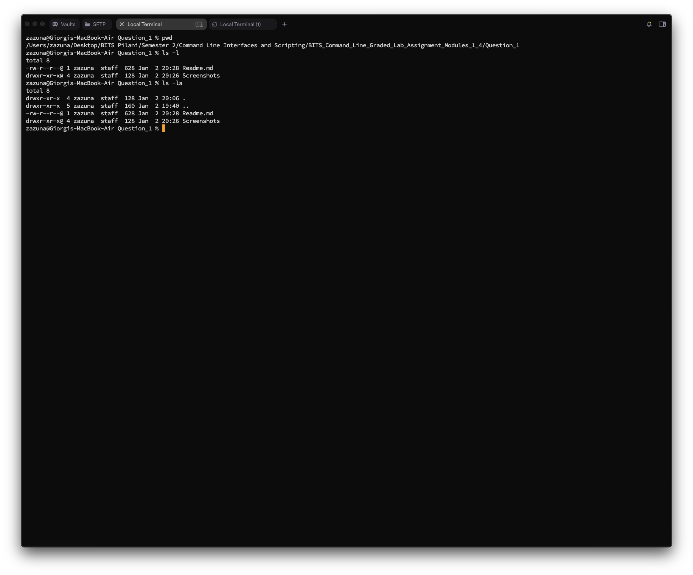
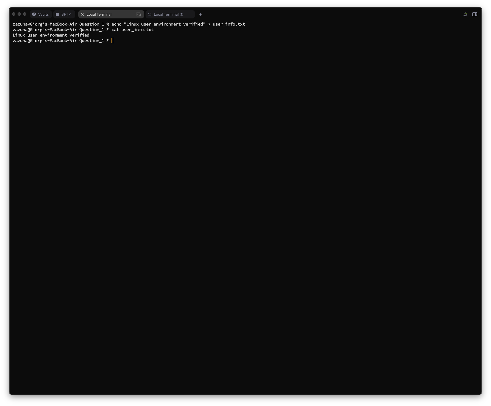
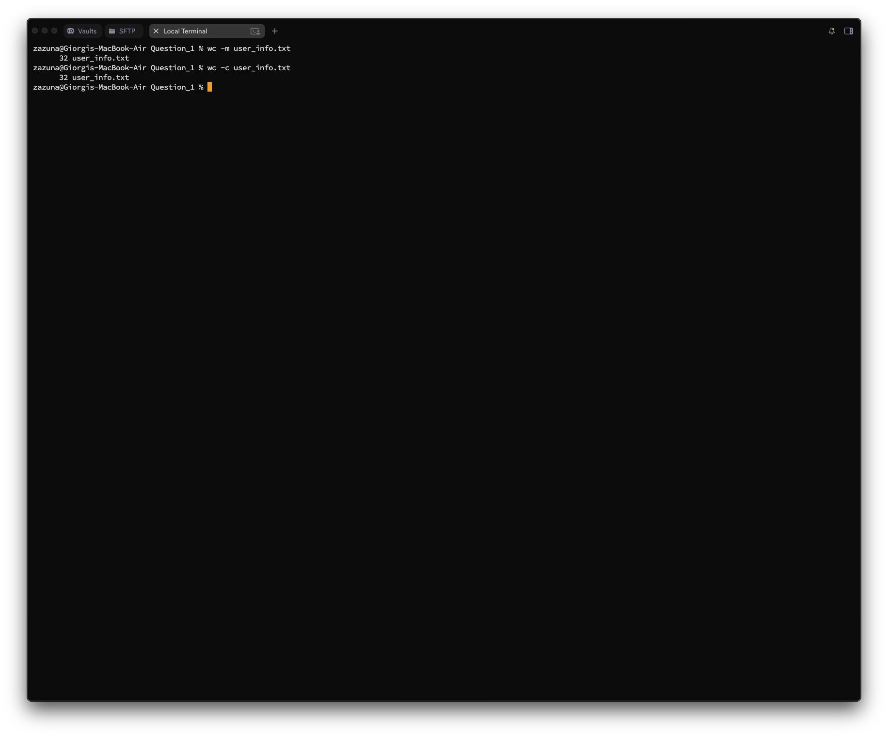
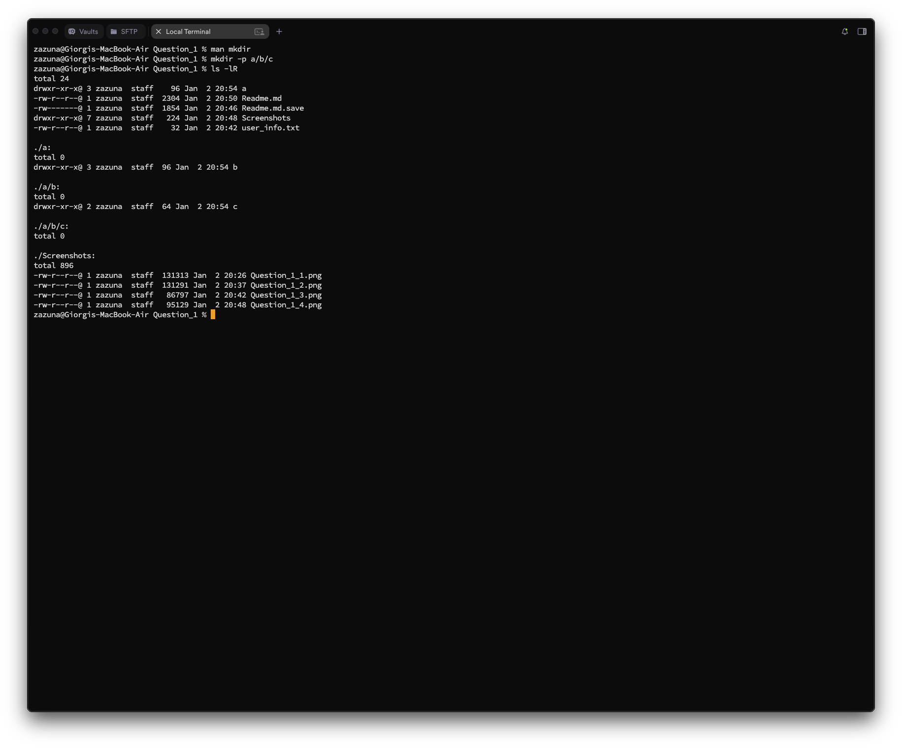
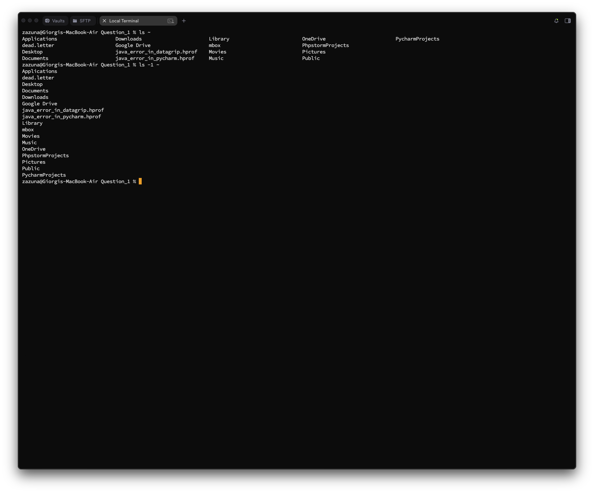

# Question 1
## Question 1_1 — User Identity Verification

### Task
**Display your currently logged-in username and all groups your user account belongs to.**  
✅ Your name/login ID must appear in the output.

---

### What I did
I used:
- `whoami` to print the currently logged-in username
- `who am i` to print the currently logged-in username, terminal session, when login session started
- `groups` to print all groups my user belongs to  
- `id` to print both currently logged-in username and all groups

---

### Commands
```bash
whoami
who am i
groups
id
```

### Screenshot


## Question_1_2 - Workspace Validation

### Task
**Display the current working directory and list all files and directories in that location using long format listing.**

___

### What I did
I used:
- `pwd` (print working directory) to show the full path of the directory I am currently in.
- `ls -l` to list the contents of the directory in "long" format, which shows pwermissions, owner, size and modification date.
- `ls -la` to list the contents of the directory in "long" format, which shows permissions, owner, size, and modification date along with hidden files.

### Commands
```bash
pwd
ls -l
ls -la
```

### Screenshot


## Question_1_3 - Environment Confirmation File

### Task
**Create a file named `user_info.txt` and write the line: "Linux user environment verified"**

### What I did
I used:
- `echo` to output the specific string of text.
- The `>` redirection operator to write that output directly into a new file named `user_info.txt`.
- `cat` to verify the file was created correctly and contains the text.

### Commands
```bash
echo "Linux user environment verified" > user_info.txt
cat user_info.txt
```

### Screenshot


## Question_1_4 - File Integrity Check

### Task
**Display the number of characters present in `user_info.txt`.**

### What I did
I used:
- `wc -m` to count the number of characters in the file.
- `wc -c` to count the number of bytes in the file. Which is usually the same as the number of characters for standard ASCII text.

### Commands
```bash
wc -m user_info.txt
wc -c user_info.txt
```

### Screenshot


## Question_1_5 - Learning the Tools

### Task
**Access the manual page of the `mkdir` command. Identify one useful option and briefly explain what it does.**

### What I did
I used:
- man `mkdir` to open the manual page for the make directory command.
- I identified the `-p` (parents) option.
- Explanation: The `-p` flag allows you to create parent directories as needed. For example, `mkdir -p a/b/c` will create directory "a", then "b" inside it, and "c" inside that, without throwing an error if "a" or "b" do not exist yet.
- ls -lR to list the contents of the directory in "long" format, which shows permissions, owner, size and modification date, to check results of `mkdir -p a/b/c`.

### Commands
```bash
man mkdir
mkdir -p a/b/c
ls -lR
```

### Screenshot


## Question_1_6 - Home Directory Inspection

### Task
**List the contents of your home directory sorted alphabetically.**

### What I did
I used:
- `ls` followed by the tilde ~, which represents the home directory.
- By default, `ls` sorts output alphabetically. I can also use `ls -1 ~` to list them in a single column for easier reading.

### Commands
```bash
ls ~
ls -1 ~
```

### Screenshot


## Question_1_7 - Log Investigation

### Task
**Seach for the word "admin" inside a file named `log.txt` and display only the matching lines.**

### What I did
I used:
- `cat > log.txt` to create a file named `log.txt` and write some text into it.
- `grep` to search for specific text patterns within a file.
- I passed the search term `"admin" `and the filename log.txt.
- This command prints only the lines where "admin" appears.
- `grep -n` to display the line numbers of the matching lines.

### Commands
```bash
cat > log.txt
grep "admin" log.txt
grep -n "admin" log.txt
```

### Screenshot
