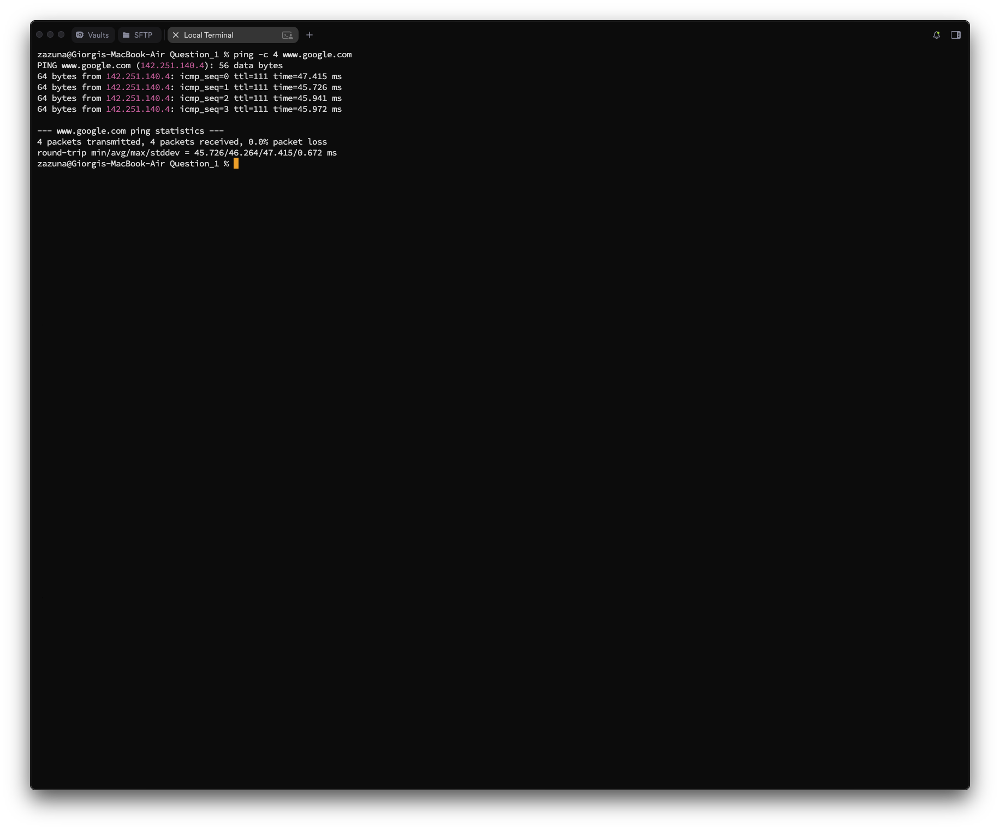
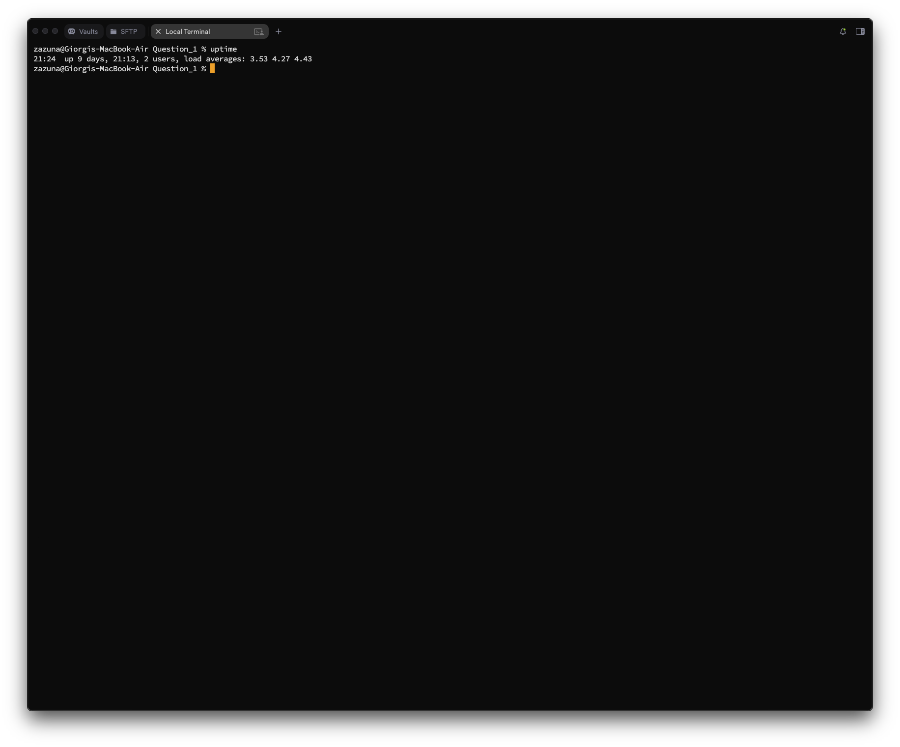

# Question 1
## Question 1_1 — User Identity Verification

### Task
**Display your currently logged-in username and all groups your user account belongs to.**  
✅ Your name/login ID must appear in the output.

---

### What I did
I used:
- `whoami` to print the currently logged-in username
- `who am i` to print the currently logged-in username, terminal session, when login session started
- `groups` to print all groups my user belongs to  
- `id` to print both currently logged-in username and all groups

---

### Commands
```bash
zazuna@Giorgis-MacBook-Air Question_1 % whoami zazuna
zazuna@Giorgis-MacBook-Air Question_1 % who am i zazuna
ttys008
Jan 2 20:00
zazuna@Giorgis-MacBook-Air Question_1 % groups
staff everyone localaccounts _appserverusr admin _appserveradm com.apple.sharepoint.group.1 _appstore _Ipadmin _Ipoperator _developer _analyticsusers com.apple.access_ftp com.apple.access_ screensharing com.apple. access_ssh com. apple. access_remote_ae zazuna@Giorgis-MacBook-Air Question_1 % id
uid=501(zazuna) gid=20 (staff) groups=20 (staff) ,12 (everyone), 61 (localaccounts), 79 (_appserverusr), 80 (admin), 81(_appserveradm), 701(com. apple. sharepoint.group.1), 33 (_appstore), 98(_1padmin), 100 (_Ipoperator), 204(_developer), 250 (_analyticsusers), 395 (com. apple. access_ftp), 398 (com. apple. access_screensharing), 399 (com. apple. access_ssh), 400 (com. apple. access_remote_ae) zazuna@Giorgis-MacBook-Air Question_1
```

### Screenshot


## Question_1_2 - Workspace Validation

### Task
**Display the current working directory and list all files and directories in that location using long format listing.**

___

### What I did
I used:
- `pwd` (print working directory) to show the full path of the directory I am currently in.
- `ls -l` to list the contents of the directory in "long" format, which shows pwermissions, owner, size and modification date.
- `ls -la` to list the contents of the directory in "long" format, which shows permissions, owner, size, and modification date along with hidden files.

### Commands
```bash
zazuna@Giorgis-MacBook-Air Question_1 % pwd
/Users/zazuna/Desktop/BITS Pilani/Semester 2/Command Line Interfaces and Scripting/BITS_Command_Line_Graded_Lab_Assignment_Modules_1_4/Question_1
zazuna@Giorgis-MacBook-Air Question_1 % ls -l 
total 40
drwxr-xr-x@  3 zazuna  staff    96 Jan  2 20:54 a
-rw-r--r--@  1 zazuna  staff    68 Jan  2 21:16 log.txt
-rw-r--r--@  1 zazuna  staff  4589 Jan  2 21:20 Readme.md
-rw-------@  1 zazuna  staff  1854 Jan  2 20:46 Readme.md.save
drwxr-xr-x@ 13 zazuna  staff   416 Jan  2 21:24 Screenshots
-rw-r--r--@  1 zazuna  staff    32 Jan  2 20:42 user_info.txt
zazuna@Giorgis-MacBook-Air Question_1 % ls -la
total 40
drwxr-xr-x   8 zazuna  staff   256 Jan  2 21:16 .
drwxr-xr-x   5 zazuna  staff   160 Jan  2 19:40 ..
drwxr-xr-x@  3 zazuna  staff    96 Jan  2 20:54 a
-rw-r--r--@  1 zazuna  staff    68 Jan  2 21:16 log.txt
-rw-r--r--@  1 zazuna  staff  4589 Jan  2 21:20 Readme.md
-rw-------@  1 zazuna  staff  1854 Jan  2 20:46 Readme.md.save
drwxr-xr-x@ 13 zazuna  staff   416 Jan  2 21:24 Screenshots
-rw-r--r--@  1 zazuna  staff    32 Jan  2 20:42 user_info.txt
zazuna@Giorgis-MacBook-Air Question_1 % 
```

### Screenshot


## Question_1_3 - Environment Confirmation File

### Task
**Create a file named `user_info.txt` and write the line: "Linux user environment verified"**

### What I did
I used:
- `echo` to output the specific string of text.
- The `>` redirection operator to write that output directly into a new file named `user_info.txt`.
- `cat` to verify the file was created correctly and contains the text.

### Commands
```bash
zazuna@Giorgis-MacBook-Air Question_1 % echo "Linux user environment verified" > user_info.txt
zazuna@Giorgis-MacBook-Air Question_1 % cat user_info.txt 
Linux user environment verified
zazuna@Giorgis-MacBook-Air Question_1 % 
```

### Screenshot


## Question_1_4 - File Integrity Check

### Task
**Display the number of characters present in `user_info.txt`.**

### What I did
I used:
- `wc -m` to count the number of characters in the file.
- `wc -c` to count the number of bytes in the file. Which is usually the same as the number of characters for standard ASCII text.

### Commands
```bash
zazuna@Giorgis-MacBook-Air Question_1 % wc -m user_info.txt 
      32 user_info.txt
zazuna@Giorgis-MacBook-Air Question_1 % wc -c user_info.txt 
      32 user_info.txt
zazuna@Giorgis-MacBook-Air Question_1 % 
```

### Screenshot


## Question_1_5 - Learning the Tools

### Task
**Access the manual page of the `mkdir` command. Identify one useful option and briefly explain what it does.**

### What I did
I used:
- man `mkdir` to open the manual page for the make directory command.
- I identified the `-p` (parents) option.
- Explanation: The `-p` flag allows you to create parent directories as needed. For example, `mkdir -p a/b/c` will create directory "a", then "b" inside it, and "c" inside that, without throwing an error if "a" or "b" do not exist yet.
- ls -lR to list the contents of the directory in "long" format, which shows permissions, owner, size and modification date, to check results of `mkdir -p a/b/c`.

### Commands
```bash
zazuna@Giorgis-MacBook-Air Question_1 % man mkdir
zazuna@Giorgis-MacBook-Air Question_1 % mkdir -p a/b/c
zazuna@Giorgis-MacBook-Air Question_1 % ls -lR
total 48
drwxr-xr-x@  3 zazuna  staff    96 Jan  2 21:32 a
-rw-r--r--@  1 zazuna  staff    68 Jan  2 21:16 log.txt
-rw-r--r--@  1 zazuna  staff  8395 Jan  2 21:32 Readme.md
-rw-------@  1 zazuna  staff  1854 Jan  2 20:46 Readme.md.save
drwxr-xr-x@ 13 zazuna  staff   416 Jan  2 21:24 Screenshots
-rw-r--r--@  1 zazuna  staff    32 Jan  2 21:31 user_info.txt

./a:
total 0
drwxr-xr-x@ 3 zazuna  staff  96 Jan  2 21:32 b

./a/b:
total 0
drwxr-xr-x@ 2 zazuna  staff  64 Jan  2 21:32 c

./a/b/c:
total 0

./Screenshots:
total 2376
-rw-r--r--@ 1 zazuna  staff  131313 Jan  2 20:26 Question_1_1.png
-rw-r--r--@ 1 zazuna  staff   88972 Jan  2 21:24 Question_1_10.png
-rw-r--r--@ 1 zazuna  staff  131291 Jan  2 20:37 Question_1_2.png
-rw-r--r--@ 1 zazuna  staff   86797 Jan  2 20:42 Question_1_3.png
-rw-r--r--@ 1 zazuna  staff   95129 Jan  2 20:48 Question_1_4.png
-rw-r--r--@ 1 zazuna  staff  158010 Jan  2 20:55 Question_1_5.png
-rw-r--r--@ 1 zazuna  staff  134348 Jan  2 21:10 Question_1_6.png
-rw-r--r--@ 1 zazuna  staff  116773 Jan  2 21:17 Question_1_7.png
-rw-r--r--@ 1 zazuna  staff  125008 Jan  2 21:21 Question_1_8.png
-rw-r--r--@ 1 zazuna  staff  125008 Jan  2 21:22 Question_1_9.png
zazuna@Giorgis-MacBook-Air Question_1 % 
```

### Screenshot


## Question_1_6 - Home Directory Inspection

### Task
**List the contents of your home directory sorted alphabetically.**

### What I did
I used:
- `ls` followed by the tilde ~, which represents the home directory.
- By default, `ls` sorts output alphabetically. I can also use `ls -1 ~` to list them in a single column for easier reading.

### Commands
```bash
zazuna@Giorgis-MacBook-Air Question_1 % ls ~
Applications                    Downloads                       Library                         OneDrive                        PycharmProjects
dead.letter                     Google Drive                    mbox                            PhpstormProjects
Desktop                         java_error_in_datagrip.hprof    Movies                          Pictures
Documents                       java_error_in_pycharm.hprof     Music                           Public
zazuna@Giorgis-MacBook-Air Question_1 % ls -1 ~
Applications
dead.letter
Desktop
Documents
Downloads
Google Drive
java_error_in_datagrip.hprof
java_error_in_pycharm.hprof
Library
mbox
Movies
Music
OneDrive
PhpstormProjects
Pictures
Public
PycharmProjects
zazuna@Giorgis-MacBook-Air Question_1 % 
```

### Screenshot


## Question_1_7 - Log Investigation

### Task
**Seach for the word "admin" inside a file named `log.txt` and display only the matching lines.**

### What I did
I used:
- `cat > log.txt` to create a file named `log.txt` and write some text into it.
- `grep` to search for specific text patterns within a file.
- I passed the search term `"admin" `and the filename log.txt.
- This command prints only the lines where "admin" appears.
- `grep -n` to display the line numbers of the matching lines.

### Commands
```bash
zazuna@Giorgis-MacBook-Air Question_1 % cat > log.txt
Hello
Test admin here
admin
what
random
admin again
adminagainadmin
zazuna@Giorgis-MacBook-Air Question_1 % grep "admin" log.txt
Test admin here
admin
admin again
adminagainadmin
zazuna@Giorgis-MacBook-Air Question_1 % grep -n "admin" log.txt
2: Test admin here
3: admin
6: admin again
7: adminagainadmin
zazuna@Giorgis-MacBook-Air Question_1 %
```

### Screenshot


## Question_1_8 - System Information Check

### Task
**Display the Linux kernel version currently running.**

### What I did
I used:
- `uname -r` to print the kernel release information.
- `uname` provides system information, and the `-r` flag isolates the specific release version of the kernel.

### Commands
```bash
zazuna@Giorgis-MacBook-Air Question_1 % uname
Darwin
zazuna@Giorgis-MacBook-Air Question_1 % uname -r
25.0.0
zazuna@Giorgis-MacBook-Air Question_1 % 
```

### Screenshot


## Question_1_9 - Network Connectivity Test

### Task
**Verify network connectivity by sending ICMP packets to `www.google.com`.**

### What I did
I used:
- `ping` to send ICMP ECHO_REQUEST packets to the network host.
- I added `-c 4` to limit the command to sending 4 packets, ensuring the process stops automatically rather than running indefinitely.

### Commands
```bash
zazuna@Giorgis-MacBook-Air Question_1 % ping -c 4 www.google.com
PING www.google.com (142.251.140.4): 56 data bytes
64 bytes from 142.251.140.4: icmp_seq=0 ttl=111 time=47.415 ms
64 bytes from
142.251.140.4: icmp_seq=1 ttl=111 time=45.726 ms
64 bytes from
142.251.140.4:
icmp_seq=2 ttl=111 time=45.941 ms
64 bytes from
142.251.140.4: icmp_seq=3 ttl=111 time=45.972 ms
--- www.google.com ping statistics ---
4 packets transmitted, 4 packets received,
0. 0% packet loss
round-trip min/avg/max/stddev = 45.726/46.264/47.415/0.672 ms
zazuna@Giorgis-MacBook-Air Question_1 %
```

### Screenshot


## Question_1_10 - System Health Awareness

### Task
**Display the command used to check system uptime and briefly explain its output (uptime duration, number of users, load average).**

### What I did
I used:
- `uptime` to display how long the system has been running.
- Explanation of output:
    - Uptime duration: Shows the current time and how long the system has been on (21:24  up 9 days).
    - Users: Shows the number of currently logged-in users (2 users).
    - Load average: Shows the average system load over the last 1, 5, and 15 minutes. This indicates how busy the CPU is. (load averages: 3.53 4.27 4.43)

### Commands
```bash
zazuna@Giorgis-MacBook-Air Question_1 % uptime    
21:24  up 9 days, 21:13, 2 users, load averages: 3.53 4.27 4.43
zazuna@Giorgis-MacBook-Air Question_1 % 
```

### Screenshot
