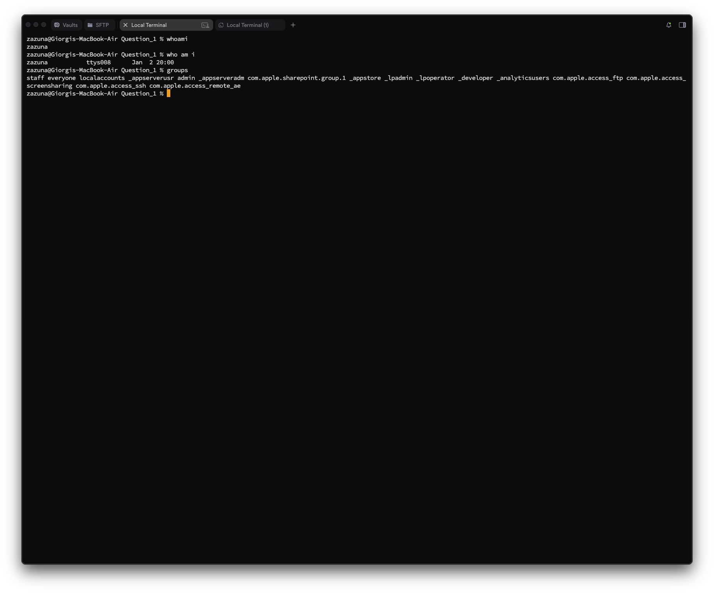

# Question 1
## Question 1_1 — User Identity Verification

### Task
**Display your currently logged-in username and all groups your user account belongs to.**  
✅ Your name/login ID must appear in the output.

---

### What I did
I used:
- `whoami` to print the currently logged-in username
- `groups` to print all groups my user belongs to  
- `id`     to print both currently logged-in username and all groups

---

### Commands
```bash
whoami
groups
```

### Screenshot

