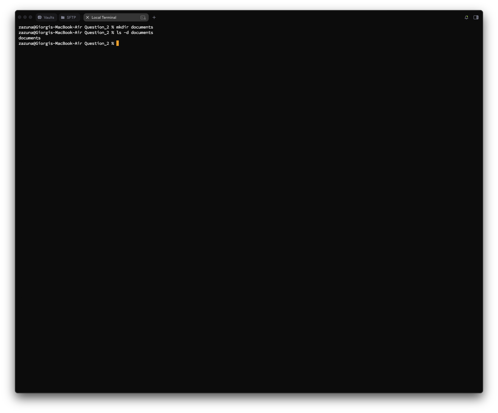
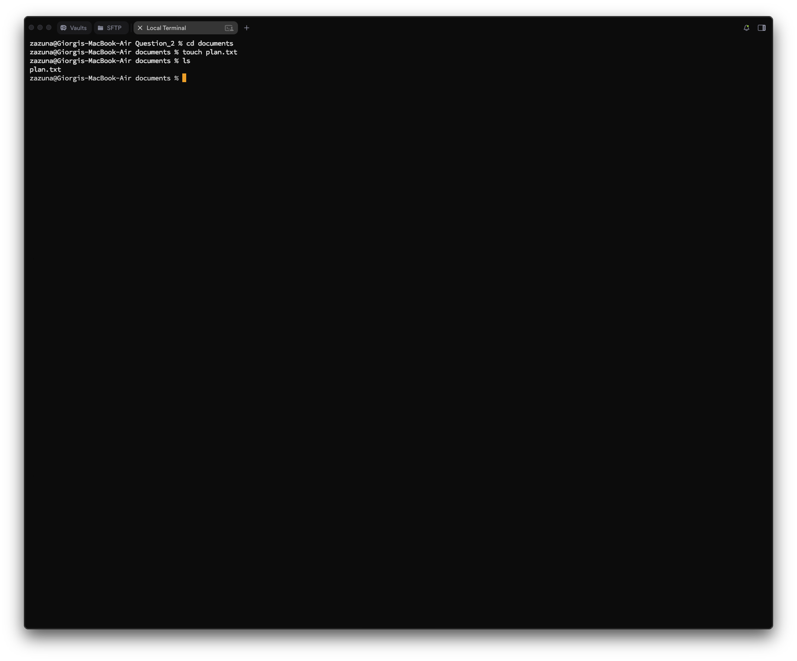
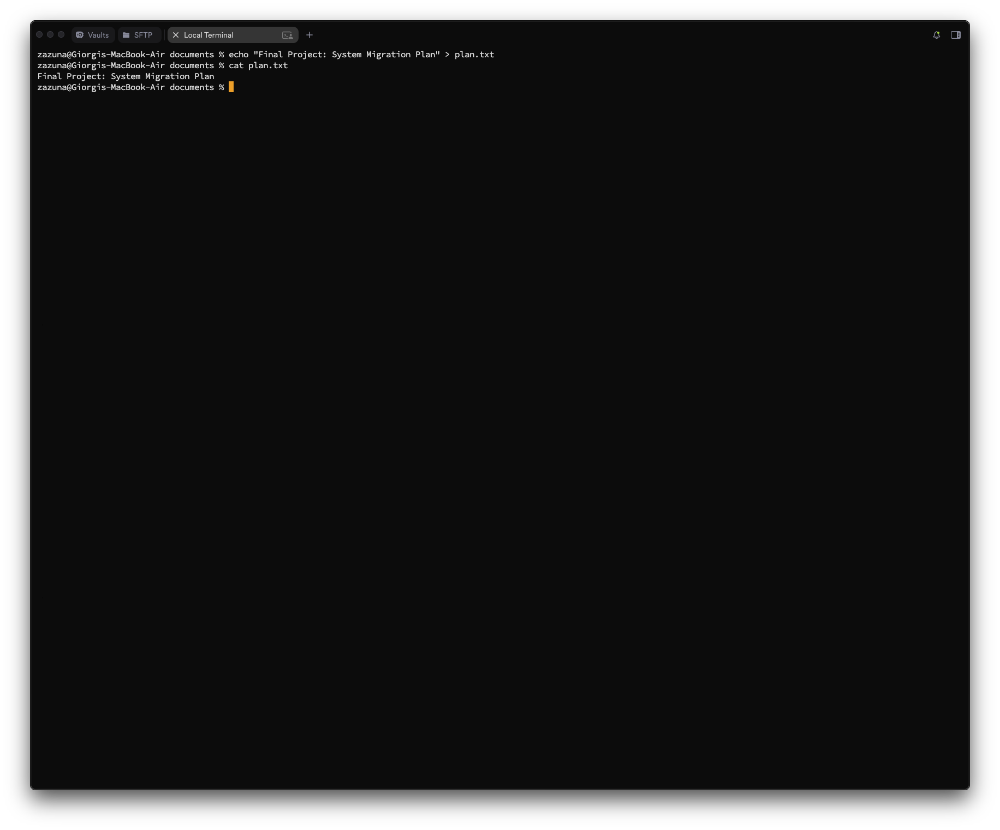
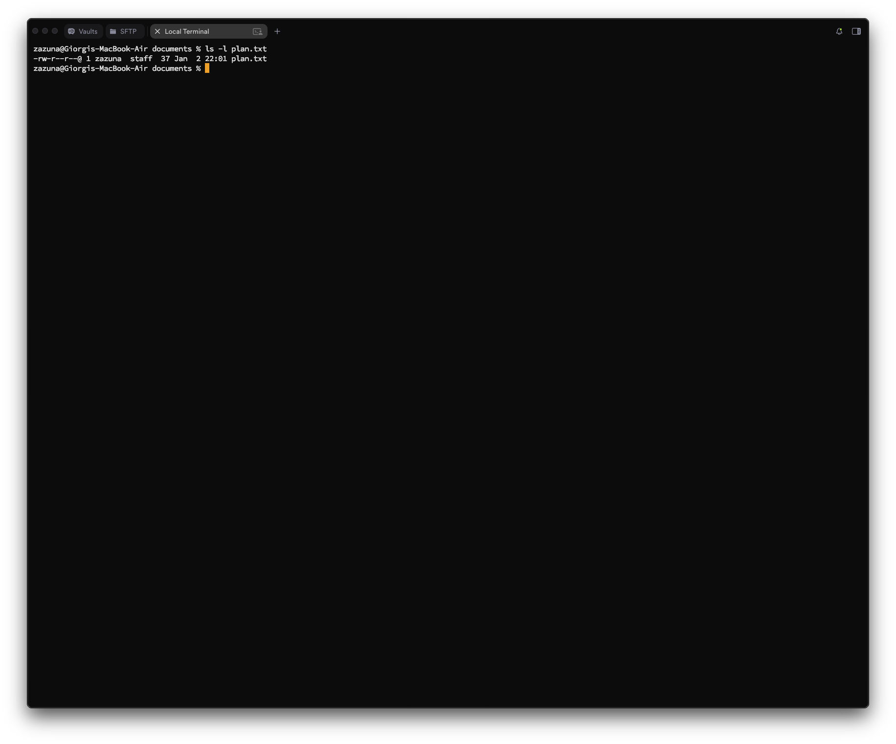
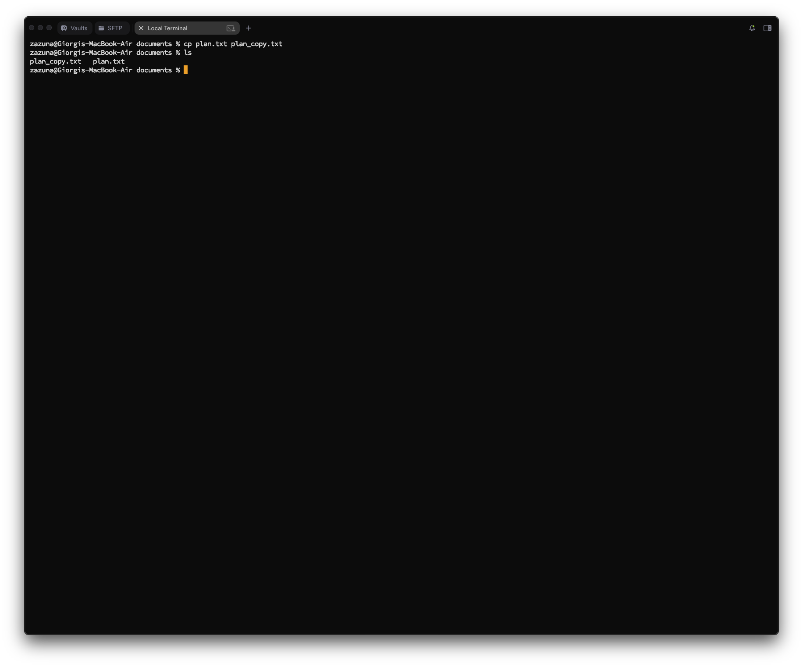
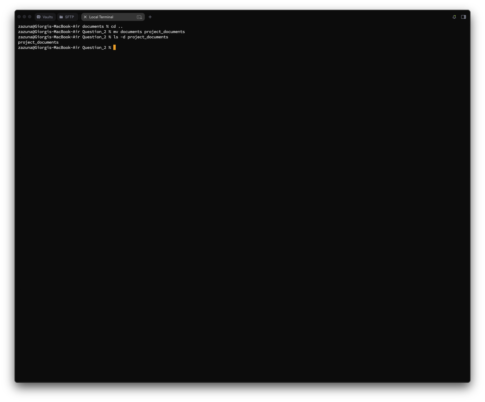
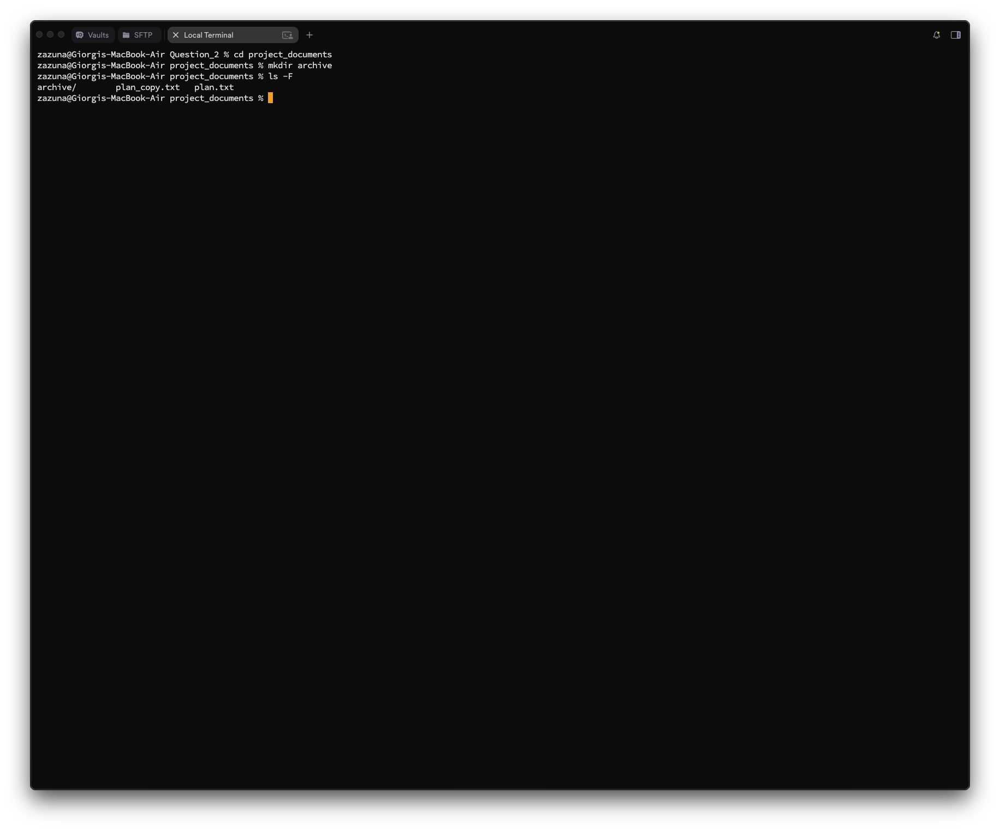
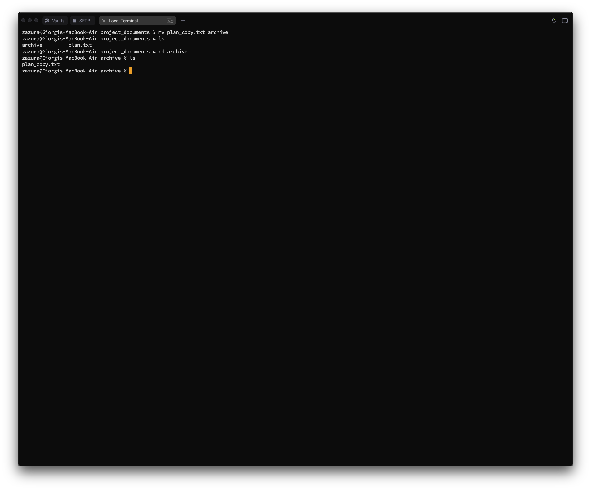
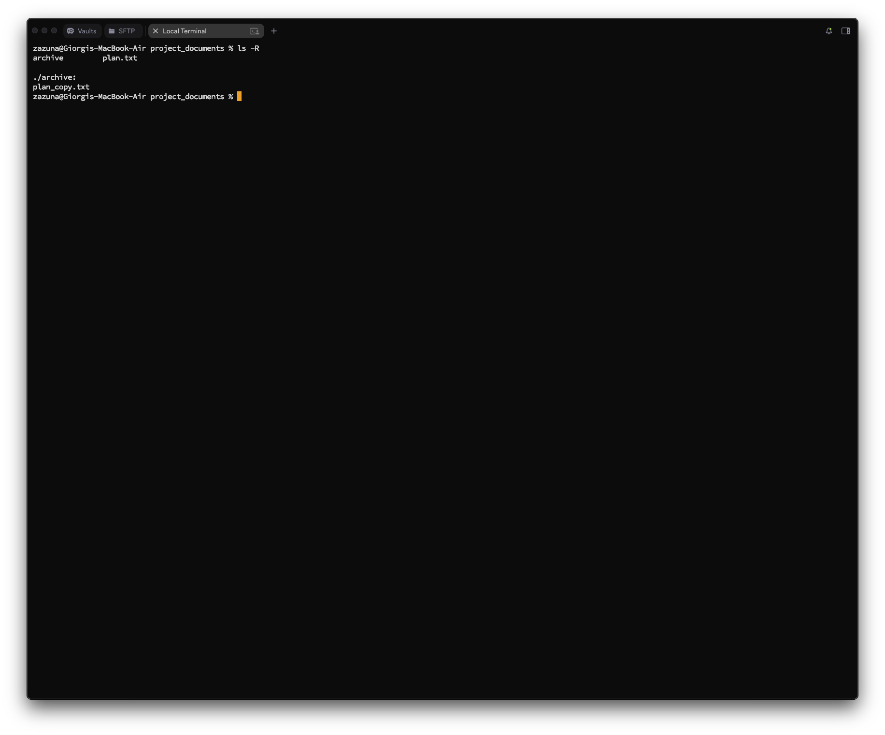
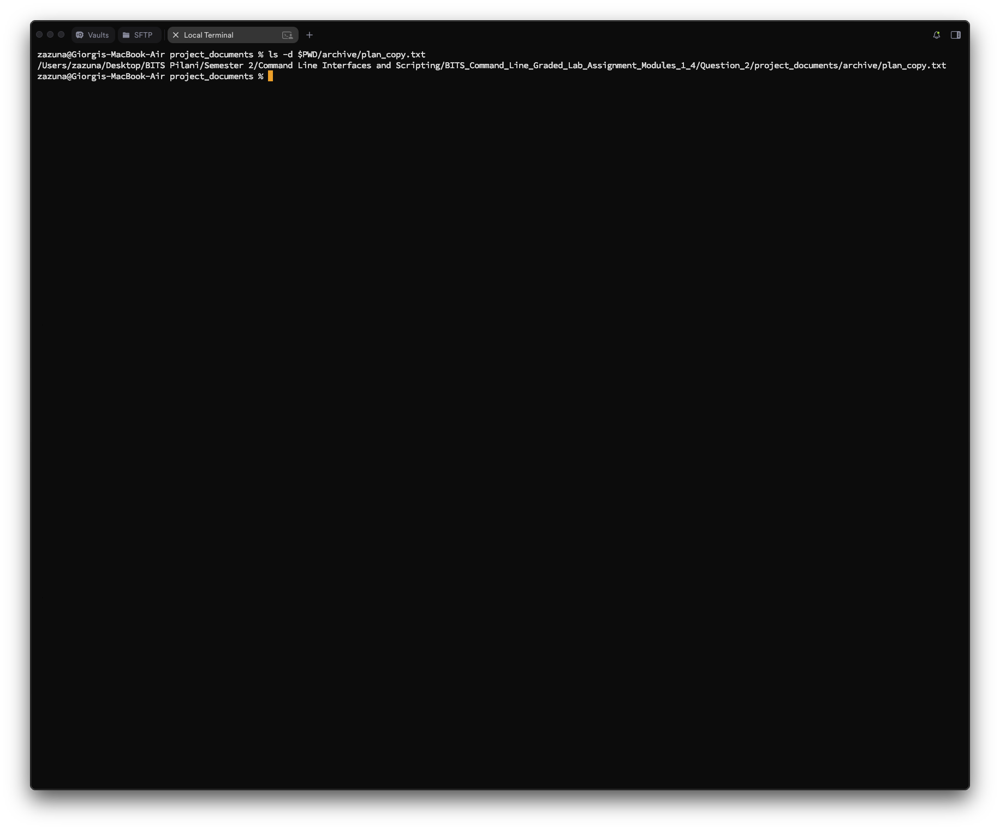

# Question 2
## Question 2_1 — Project Workspace Setup

### Task
**Create a directory named `documents` inside your home directory. This directory will store your project-related files.**

---

### What I did
I used:
- `cd ~` to ensure I am currently in my home directory. (I have not actually Used in my workflow as long as I have documents folder already in my home directory, instead I used Question_2 folder)
- `mkdir` to create the new directory.
- `ls -d` to verify the directory was created successfully.

### Commands
```bash
zazuna@Giorgis-MacBook-Air Question_2 % mkdir documents 
zazuna@Giorgis-MacBook-Air Question_2 % ls -d documents 
documents
zazuna@Giorgis-MacBook-Air Question_2 % 
```

### Screenshot


## Question 2_2 — File Creation

### Task
**Navigate into the `documents` directory and create a file named `plan.txt`.**

---

### What I did
I used:
- `cd` to change my current working directory to `documents`.
- `touch` to create an empty file named `plan.txt`.
- `ls` to verify the file was created.

### Commands
```bash
zazuna@Giorgis-MacBook-Air Question_2 % cd documents 
zazuna@Giorgis-MacBook-Air documents % touch plan.txt
zazuna@Giorgis-MacBook-Air documents % ls
plan.txt
zazuna@Giorgis-MacBook-Air documents % 
```

### Screenshot


## Question 2_3 — Content Addition

### Task
**Write some sample text of your choice into the `plan.txt` file.**

---

### What I did
I used:
- `echo` to generate the text string "Final Project: System Migration Plan".
- `>` to redirect that text into the `plan.txt` file, overwriting any previous content.
- `cat` to display the file contents and verify the write operation.

### Commands
```bash
zazuna@Giorgis-MacBook-Air documents % echo "Final Project: System Migration Plan" > plan.txt
zazuna@Giorgis-MacBook-Air documents % cat plan.txt
Final Project: System Migration Plan
zazuna@Giorgis-MacBook-Air documents %
```

### Screenshot


## Question 2_4 — File Metadata Verification

### Task
**Display the permissions and ownership details of the `plan.txt` file. Ensure your username appears in the output.**

---

### What I did
I used:
- `ls -l` (long listing) to view file permissions (`-rw-r--r--`), the owner (`zazuna`), and the group (`staff`).

### Commands
```bash
zazuna@Giorgis-MacBook-Air documents % ls -l plan.txt 
-rw-r--r--@ 1 zazuna  staff  37 Jan  2 22:01 plan.txt
zazuna@Giorgis-MacBook-Air documents % 
```

### Screenshot


## Question 2_5 — File Duplication

### Task
**Create a copy of `plan.txt` and name it `plan_copy.txt`.**

---

### What I did
I used:
- `cp` to copy the source file (`plan.txt`) to a new destination file (`plan_copy.txt`).
- `ls` to verify both files now exist in the directory.

### Commands
```bash
zazuna@Giorgis-MacBook-Air documents % cp plan.txt plan_copy.txt
zazuna@Giorgis-MacBook-Air documents % ls
plan_copy.txt   plan.txt
zazuna@Giorgis-MacBook-Air documents % 
```

### Screenshot


## Question 2_6 — Directory Renaming

### Task
**Rename the `documents` directory to `project_documents` to reflect the project scope more clearly.**

---

### What I did
I used:
- `cd ..` to move up one level to the parent directory (Home), because I cannot rename the directory I am currently inside.
- `mv` to rename the directory from `documents` to `project_documents`.
- `ls -d` to confirm the rename.

### Commands
```bash
zazuna@Giorgis-MacBook-Air documents % cd ..
zazuna@Giorgis-MacBook-Air Question_2 % mv documents project_documents
zazuna@Giorgis-MacBook-Air Question_2 % ls -d project_documents 
project_documents
zazuna@Giorgis-MacBook-Air Question_2 % 
```

### Screenshot


## Question 2_7 — Archival Structure

### Task
**Inside the `project_documents` directory, create a subdirectory named `archive`.**

---

### What I did
I used:
- `cd` to navigate into `project_documents`.
- `mkdir` to create the new `archive` folder.

### Commands
```bash
zazuna@Giorgis-MacBook-Air Question_2 % cd project_documents 
zazuna@Giorgis-MacBook-Air project_documents % mkdir archive
zazuna@Giorgis-MacBook-Air project_documents % ls -F
archive/        plan_copy.txt   plan.txt
zazuna@Giorgis-MacBook-Air project_documents %
```

### Screenshot


## Question 2_8 — File Organization

### Task
**Move `plan_copy.txt` into the `archive` subdirectory.**

---

### What I did
I used:
- `mv` to move the file `plan_copy.txt` into the `archive/` directory.
- `ls` to verify it is gone from the current location.
- `ls archive` to verify it arrived in the new location.

### Commands
```bash
zazuna@Giorgis-MacBook-Air project_documents % mv plan_copy.txt archive 
zazuna@Giorgis-MacBook-Air project_documents % ls 
archive         plan.txt
zazuna@Giorgis-MacBook-Air project_documents % cd archive 
zazuna@Giorgis-MacBook-Air archive % ls
plan_copy.txt
zazuna@Giorgis-MacBook-Air archive %
```

### Screenshot


## Question 2_9 — Recursive Listing

### Task
**List all files and subdirectories inside `project_documents` recursively so that the complete directory structure is visible.**

---

### What I did
I used:
- `ls -R` (recursive) to list the current directory contents and the contents of any subdirectories (like `archive`) simultaneously.

### Commands
```bash
zazuna@Giorgis-MacBook-Air project_documents % ls -R
archive         plan.txt

./archive:
plan_copy.txt
zazuna@Giorgis-MacBook-Air project_documents %
```

### Screenshot


## Question 2_10 — Path Verification

### Task
**Display the absolute path of the `plan_copy.txt` file after it has been moved to the `archive` directory.**

---

### What I did
I used:
- `ls` combined with the `$PWD` (Print Working Directory) variable to construct and display the full absolute path.

### Commands
```bash
zazuna@Giorgis-MacBook-Air project_documents % ls -d $PWD/archive/plan_copy.txt 
/Users/zazuna/Desktop/BITS Pilani/Semester 2/Command Line Interfaces and Scripting/BITS_Command_Line_Graded_Lab_Assignment_Modules_1_4/Question_2/project_documents/archive/plan_copy.txt
zazuna@Giorgis-MacBook-Air project_documents %
```

### Screenshot

