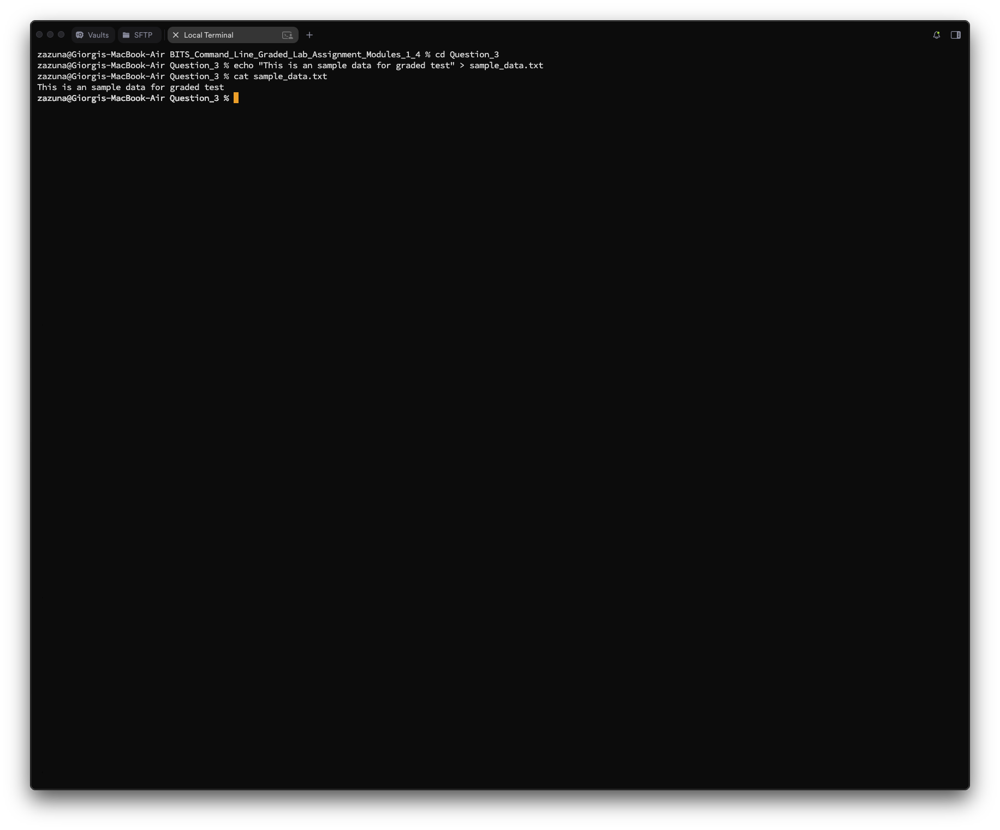
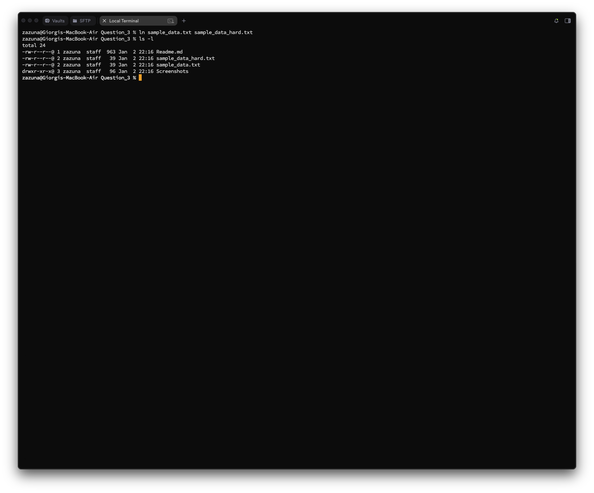
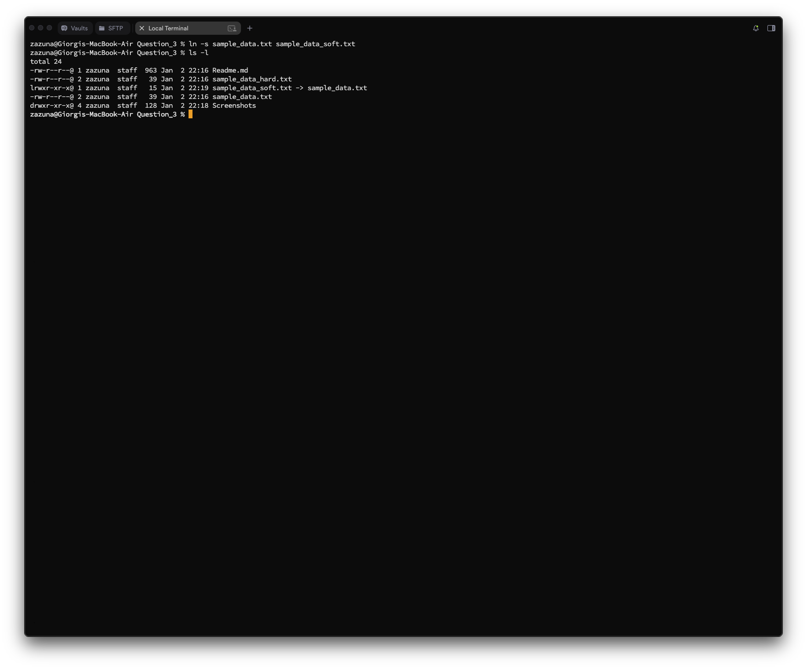
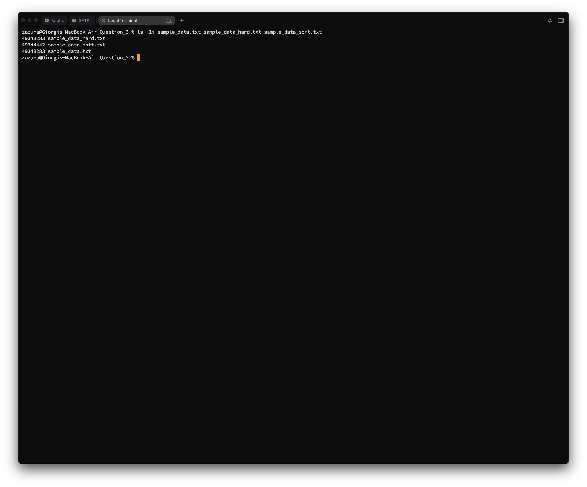
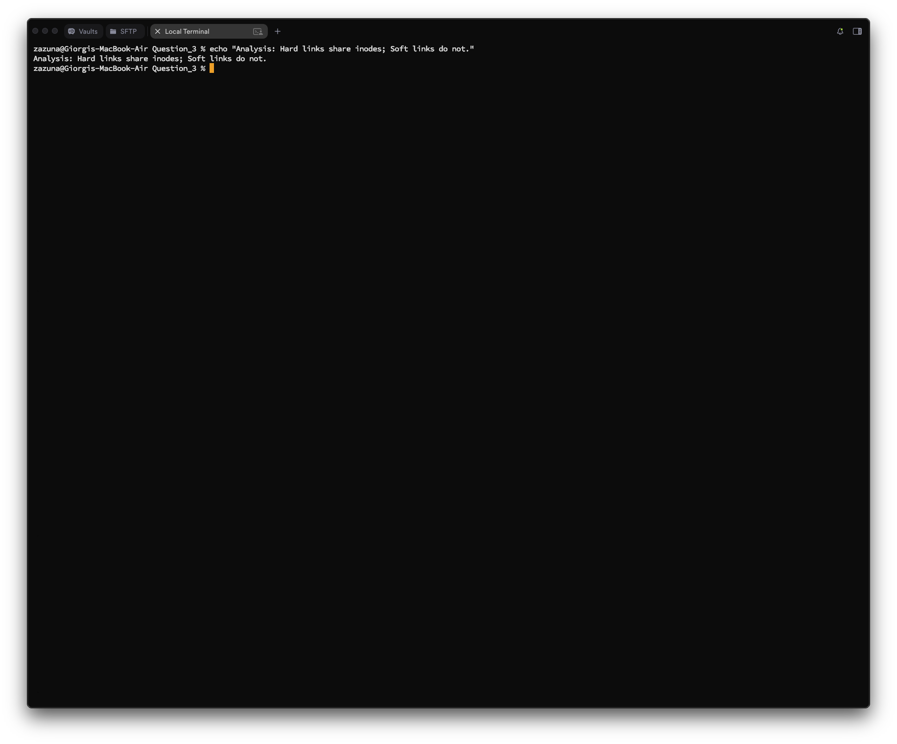
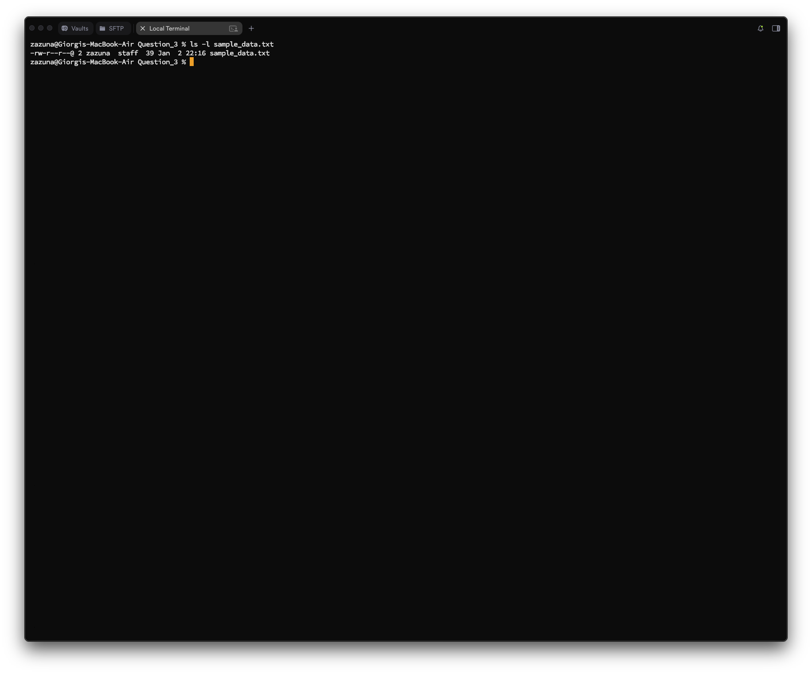
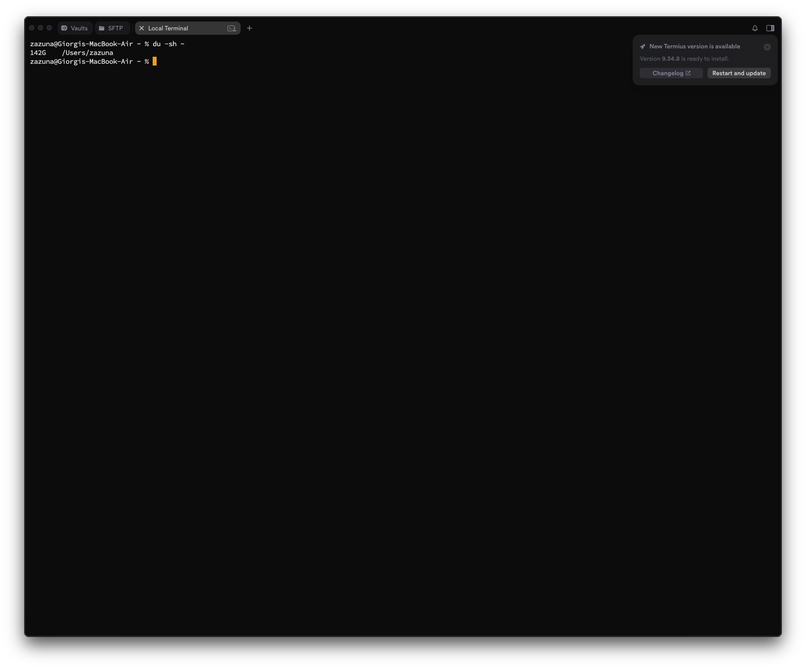
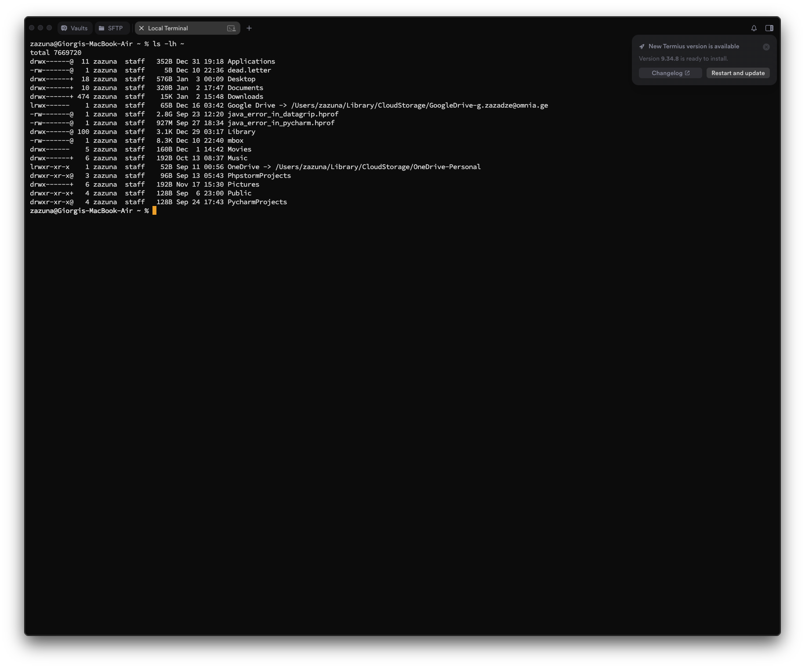
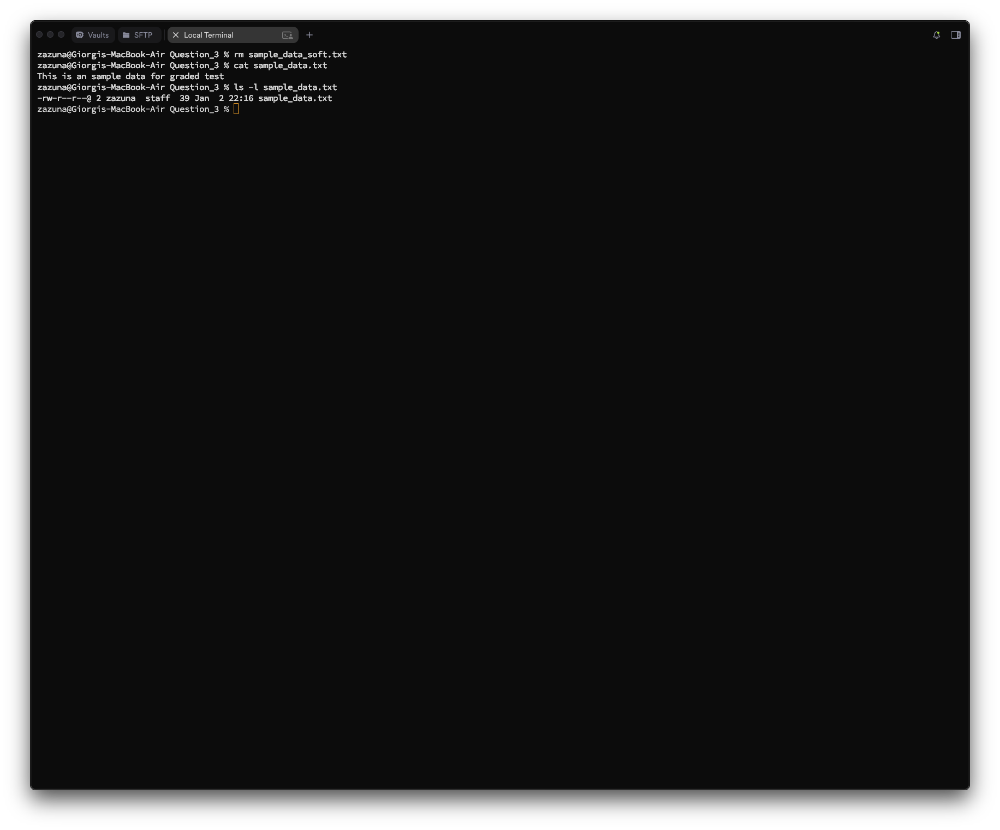
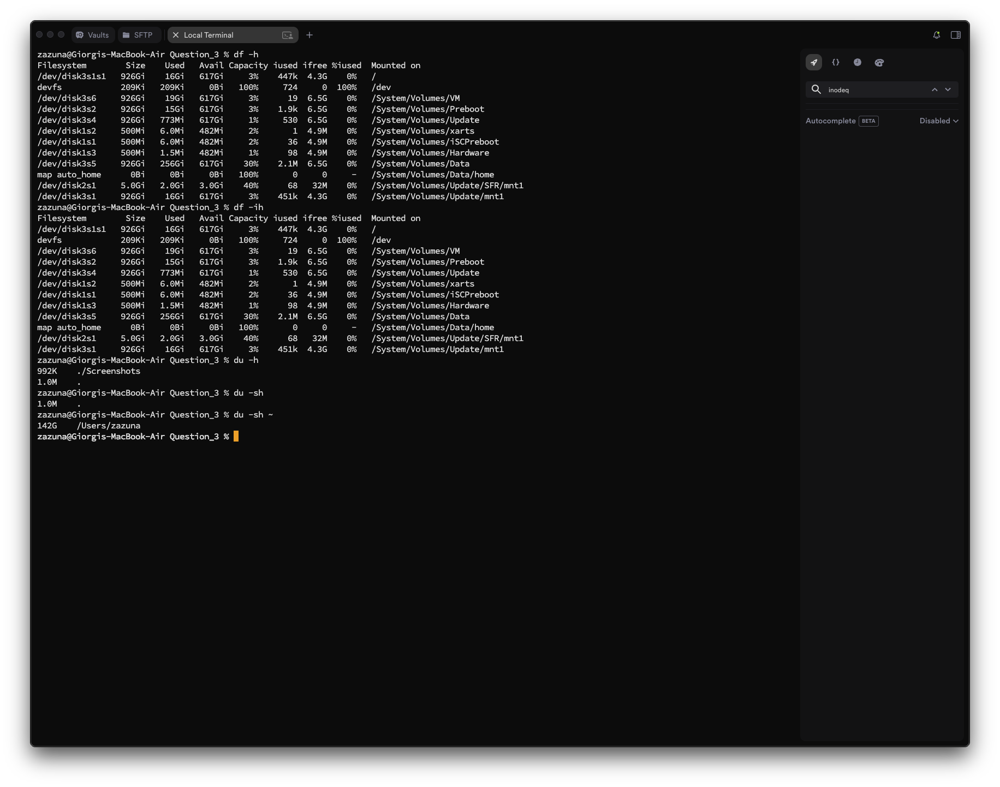

# Question 3
## Question 3_1 — File Creation

### Task
**Create a file named `sample_data.txt` in your home directory and add some sample text to it.**

---

### What I did
I used:
- `cd ~` to ensure I am in the home directory. (I have not actually Used in my workflow as long as I have documents folder already in my home directory, instead I used Question_3 folder)
- `echo` to write the text "This is important data for linking tests."
- `>` to redirect that text into a new file named `sample_data.txt`.
- `cat` to verify the content.

### Commands
```bash
zazuna@Giorgis-MacBook-Air BITS_Command_Line_Graded_Lab_Assignment_Modules_1_4 % cd Question_3
zazuna@Giorgis-MacBook-Air Question_3 % echo "This is an sample data for graded test" > sample_data.txt
zazuna@Giorgis-MacBook-Air Question_3 % cat sample_data.txt 
This is an sample data for graded test
zazuna@Giorgis-MacBook-Air Question_3 %
```

### Screenshot


## Question 3_2 — Hard Link Creation

### Task
**Create a hard link to `sample_data.txt` named `sample_hard.txt`.**

---

### What I did
I used:
- `ln` (without the -s flag) to create a hard link.
- The first argument is the existing file (`sample_data.txt`), and the second is the new link name (`sample_hard.txt`).
- `ls -l` to verify creation.

### Commands
```bash
zazuna@Giorgis-MacBook-Air Question_3 % ln sample_data.txt sample_data_hard.txt
zazuna@Giorgis-MacBook-Air Question_3 % ls -l 
total 24
-rw-r--r--@ 1 zazuna  staff  963 Jan  2 22:16 Readme.md
-rw-r--r--@ 2 zazuna  staff   39 Jan  2 22:16 sample_data_hard.txt
-rw-r--r--@ 2 zazuna  staff   39 Jan  2 22:16 sample_data.txt
drwxr-xr-x@ 3 zazuna  staff   96 Jan  2 22:16 Screenshots
zazuna@Giorgis-MacBook-Air Question_3 % 
```

### Screenshot


## Question 3_3 — Symbolic Link Creation

### Task
**Create a symbolic (soft) link to `sample_data.txt` named `sample_soft.txt`.**

---

### What I did
I used:
- `ln -s` to create a symbolic link.
- The `-s` flag tells the system to create a soft reference (pointer) rather than a direct hard link.

### Commands
```bash
zazuna@Giorgis-MacBook-Air Question_3 % ln -s sample_data.txt sample_data_soft.txt
zazuna@Giorgis-MacBook-Air Question_3 % ls -l
total 24
-rw-r--r--@ 1 zazuna  staff  963 Jan  2 22:16 Readme.md
-rw-r--r--@ 2 zazuna  staff   39 Jan  2 22:16 sample_data_hard.txt
lrwxr-xr-x@ 1 zazuna  staff   15 Jan  2 22:19 sample_data_soft.txt -> sample_data.txt
-rw-r--r--@ 2 zazuna  staff   39 Jan  2 22:16 sample_data.txt
drwxr-xr-x@ 4 zazuna  staff  128 Jan  2 22:18 Screenshots
zazuna@Giorgis-MacBook-Air Question_3 %
```

### Screenshot


## Question 3_4 — Inode Verification

### Task
**Display the inode numbers of `sample_data.txt`, `sample_hard.txt`, and `sample_soft.txt`.**

---

### What I did
I used:
- `ls` with the `-i` (inode) flag to display the index node number for each file.
- I listed all three files to compare them side-by-side.

### Commands
```bash
zazuna@Giorgis-MacBook-Air Question_3 % ls -1i sample_data.txt sample_data_hard.txt sample_data_soft.txt 
49343283 sample_data_hard.txt
49344442 sample_data_soft.txt
49343283 sample_data.txt
zazuna@Giorgis-MacBook-Air Question_3 % 
```

### Screenshot


## Question 3_5 — Inode Analysis

### Task
**Identify which files share the same inode number and briefly explain the reason.**

---

### What I did
I analyzed the output from the previous step.
- **Observation:** `sample_data.txt` and `sample_hard.txt` share the exact same inode number. `sample_soft.txt` has a different inode number.
- **Explanation:** A hard link points directly to the data on the disk (the inode). Therefore, the original file and the hard link are essentially two names for the same file data. A symbolic link is a separate file that contains a path pointing to the original file, so it requires its own unique inode.

### Commands
```bash
zazuna@Giorgis-MacBook-Air Question_3 % echo "Analysis: Hard links share inodes; Soft links do not."
Analysis: Hard links share inodes; Soft links do not.
zazuna@Giorgis-MacBook-Air Question_3 %
```

### Screenshot


## Question 3_6 — File Metadata Inspection

### Task
**Display detailed file information (permissions, ownership, size, timestamps) of `sample_data.txt`.**

---

### What I did
I used:
- `ls -l` (long format) to view the required metadata.
- It displays: Permissions (`-rw-r--r--`), Link count (`2`), Owner (`zazuna`), Group (`staff`), Size (`38` bytes), and Timestamp.

### Commands
```bash
zazuna@Giorgis-MacBook-Air Question_3 % ls -l sample_data.txt 
-rw-r--r--@ 2 zazuna  staff  39 Jan  2 22:16 sample_data.txt
zazuna@Giorgis-MacBook-Air Question_3 %
```

### Screenshot


## Question 3_7 — Disk Usage Check

### Task
**Display the disk usage of your home directory in a human-readable format.**

---

### What I did
I used:
- `du` (disk usage) command.
- `-s` (summary) to prevent listing every single subdirectory.
- `-h` (human-readable) to show sizes in K, M, or G instead of bytes.
- `~` to specify the home directory.

### Commands
```bash
zazuna@Giorgis-MacBook-Air ~ % du -sh ~
142G    /Users/zazuna
zazuna@Giorgis-MacBook-Air ~ %
```

### Screenshot


## Question 3_8 — File Size Overview

### Task
**Display the size of each file present in your home directory in a human-readable format.**

---

### What I did
I used:
- `ls -lh` to list files.
- `-l` provides the long listing with file sizes.
- `-h` converts those sizes into human-readable units (e.g., KB, MB).

### Commands
```bash
zazuna@Giorgis-MacBook-Air ~ % ls -lh ~
total 7669720
drwx------@  11 zazuna  staff   352B Dec 31 19:18 Applications
-rw-------@   1 zazuna  staff     5B Dec 10 22:36 dead.letter
drwx------+  18 zazuna  staff   576B Jan  3 00:09 Desktop
drwx------+  10 zazuna  staff   320B Jan  2 17:47 Documents
drwx------+ 474 zazuna  staff    15K Jan  2 15:48 Downloads
lrwx------    1 zazuna  staff    65B Dec 16 03:42 Google Drive -> /Users/zazuna/Library/CloudStorage/GoogleDrive-g.zazadze@omnia.ge
-rw-------@   1 zazuna  staff   2.8G Sep 23 12:20 java_error_in_datagrip.hprof
-rw-------@   1 zazuna  staff   927M Sep 27 18:34 java_error_in_pycharm.hprof
drwx------@ 100 zazuna  staff   3.1K Dec 29 03:17 Library
-rw-------@   1 zazuna  staff   8.3K Dec 10 22:40 mbox
drwx------    5 zazuna  staff   160B Dec  1 14:42 Movies
drwx------+   6 zazuna  staff   192B Oct 13 08:37 Music
lrwxr-xr-x    1 zazuna  staff    52B Sep 11 00:56 OneDrive -> /Users/zazuna/Library/CloudStorage/OneDrive-Personal
drwxr-xr-x@   3 zazuna  staff    96B Sep 13 05:43 PhpstormProjects
drwx------+   6 zazuna  staff   192B Nov 17 15:30 Pictures
drwxr-xr-x+   4 zazuna  staff   128B Sep  6 23:00 Public
drwxr-xr-x@   4 zazuna  staff   128B Sep 24 17:43 PycharmProjects
zazuna@Giorgis-MacBook-Air ~ % 
```

### Screenshot


## Question 3_9 — Link Deletion Test

### Task
**Delete the symbolic link `sample_soft.txt` and verify that the original file `sample_data.txt` is unaffected.**

---

### What I did
I used:
- `rm` to remove the symbolic link.
- `ls -l` to check that `sample_data.txt` still exists.
- `cat` to verify the content of `sample_data.txt` is still readable.

### Commands
```bash
zazuna@Giorgis-MacBook-Air Question_3 % rm sample_data_soft.txt 
zazuna@Giorgis-MacBook-Air Question_3 % cat sample_data.txt 
This is an sample data for graded test
zazuna@Giorgis-MacBook-Air Question_3 % ls -l sample_data.txt 
-rw-r--r--@ 2 zazuna  staff  39 Jan  2 22:16 sample_data.txt
zazuna@Giorgis-MacBook-Air Question_3 % 
```

### Screenshot


## Question 3_10 — Disk Utility Demonstration

### Task
**Demonstrate the usage of `du` and `df` commands using various useful options and briefly explain the output.**

---

### What I did
I used:
- `df -h`: To show free disk space on the file system in a human-readable format.
    - Output explanation: Shows the mounted filesystems (like `/System/Volumes/Data`), their total Size, Used space, Available space, and Capacity percentage.
- `df -ih`: To show free disk space on the file system in a human-readable format.
    - Output explanation: Shows the mounted filesystems (like `/System/Volumes/Data`), their total Size, Used space, Available space, and Capacity percentage. `-i` Shows inode info (how many file entries are used/free).
- `du -h`: To estimate file space usage for the current directory.
    - Output explanation: Lists the size of files and directories in the current location in human-readable units (K/M/G).
- `du -sh`: To show the total size of the current directory. (`-s` for summary)
    - Output explanation: Shows the total size of the current directory in human-readable units (K/M/G).
- `du -sh ~`: To show the total size of the home directory.
    - Output explanation: Shows the total size of the home directory in huma-readable units (K/M/G)

### Commands
```bash
zazuna@Giorgis-MacBook-Air Question_3 % df -h
Filesystem        Size    Used   Avail Capacity iused ifree %iused  Mounted on
/dev/disk3s1s1   926Gi    16Gi   617Gi     3%    447k  4.3G    0%   /
devfs            209Ki   209Ki     0Bi   100%     724     0  100%   /dev
/dev/disk3s6     926Gi    19Gi   617Gi     3%      19  6.5G    0%   /System/Volumes/VM
/dev/disk3s2     926Gi    15Gi   617Gi     3%    1.9k  6.5G    0%   /System/Volumes/Preboot
/dev/disk3s4     926Gi   773Mi   617Gi     1%     530  6.5G    0%   /System/Volumes/Update
/dev/disk1s2     500Mi   6.0Mi   482Mi     2%       1  4.9M    0%   /System/Volumes/xarts
/dev/disk1s1     500Mi   6.0Mi   482Mi     2%      36  4.9M    0%   /System/Volumes/iSCPreboot
/dev/disk1s3     500Mi   1.5Mi   482Mi     1%      98  4.9M    0%   /System/Volumes/Hardware
/dev/disk3s5     926Gi   256Gi   617Gi    30%    2.1M  6.5G    0%   /System/Volumes/Data
map auto_home      0Bi     0Bi     0Bi   100%       0     0     -   /System/Volumes/Data/home
/dev/disk2s1     5.0Gi   2.0Gi   3.0Gi    40%      68   32M    0%   /System/Volumes/Update/SFR/mnt1
/dev/disk3s1     926Gi    16Gi   617Gi     3%    451k  4.3G    0%   /System/Volumes/Update/mnt1
zazuna@Giorgis-MacBook-Air Question_3 % df -ih
Filesystem        Size    Used   Avail Capacity iused ifree %iused  Mounted on
/dev/disk3s1s1   926Gi    16Gi   617Gi     3%    447k  4.3G    0%   /
devfs            209Ki   209Ki     0Bi   100%     724     0  100%   /dev
/dev/disk3s6     926Gi    19Gi   617Gi     3%      19  6.5G    0%   /System/Volumes/VM
/dev/disk3s2     926Gi    15Gi   617Gi     3%    1.9k  6.5G    0%   /System/Volumes/Preboot
/dev/disk3s4     926Gi   773Mi   617Gi     1%     530  6.5G    0%   /System/Volumes/Update
/dev/disk1s2     500Mi   6.0Mi   482Mi     2%       1  4.9M    0%   /System/Volumes/xarts
/dev/disk1s1     500Mi   6.0Mi   482Mi     2%      36  4.9M    0%   /System/Volumes/iSCPreboot
/dev/disk1s3     500Mi   1.5Mi   482Mi     1%      98  4.9M    0%   /System/Volumes/Hardware
/dev/disk3s5     926Gi   256Gi   617Gi    30%    2.1M  6.5G    0%   /System/Volumes/Data
map auto_home      0Bi     0Bi     0Bi   100%       0     0     -   /System/Volumes/Data/home
/dev/disk2s1     5.0Gi   2.0Gi   3.0Gi    40%      68   32M    0%   /System/Volumes/Update/SFR/mnt1
/dev/disk3s1     926Gi    16Gi   617Gi     3%    451k  4.3G    0%   /System/Volumes/Update/mnt1
zazuna@Giorgis-MacBook-Air Question_3 % du -h
992K    ./Screenshots
1.0M    .
zazuna@Giorgis-MacBook-Air Question_3 % du -sh
1.0M    .
zazuna@Giorgis-MacBook-Air Question_3 % du -sh ~
142G    /Users/zazuna
zazuna@Giorgis-MacBook-Air Question_3 % 
```

### Screenshot

