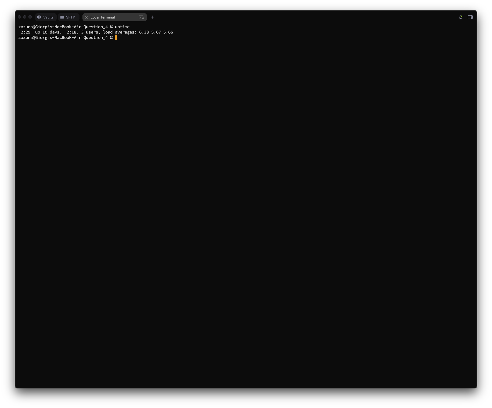
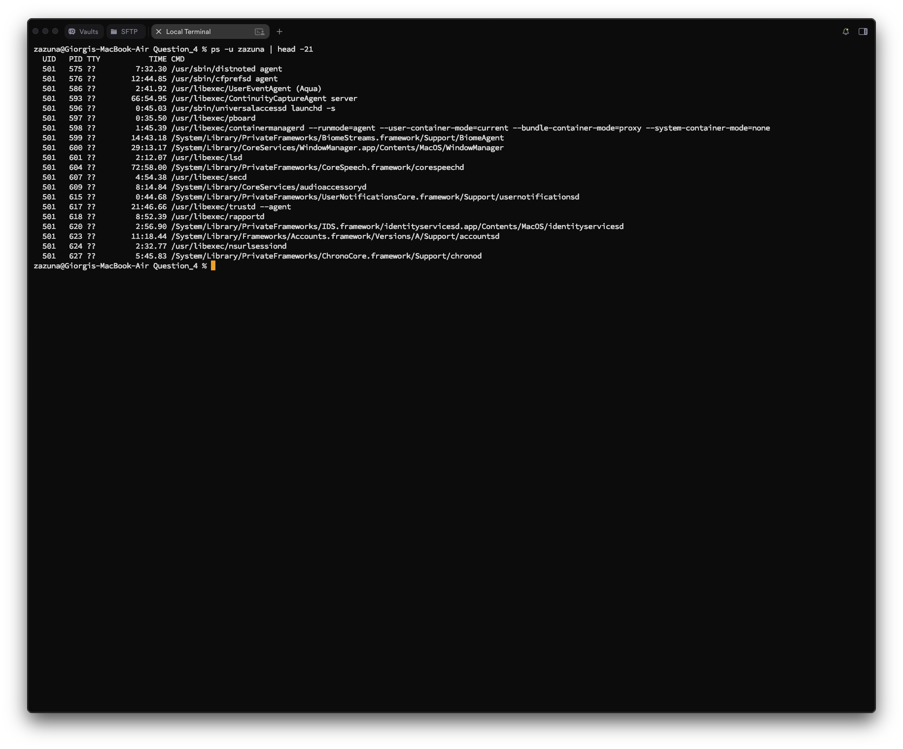
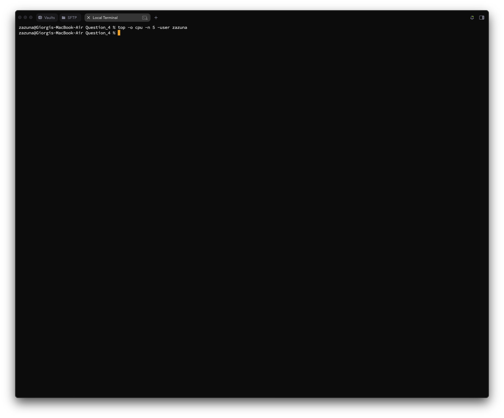
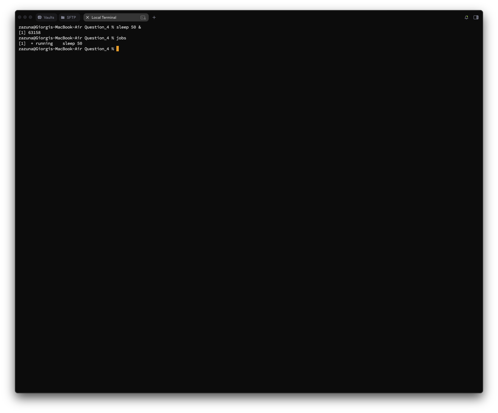
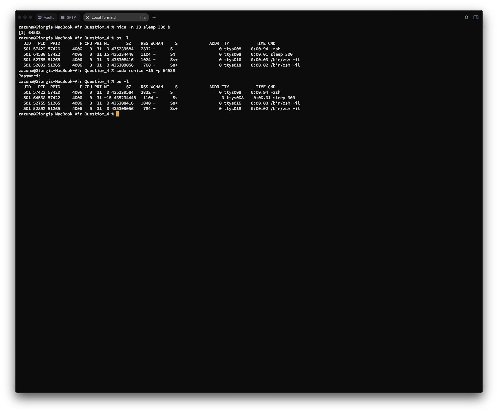
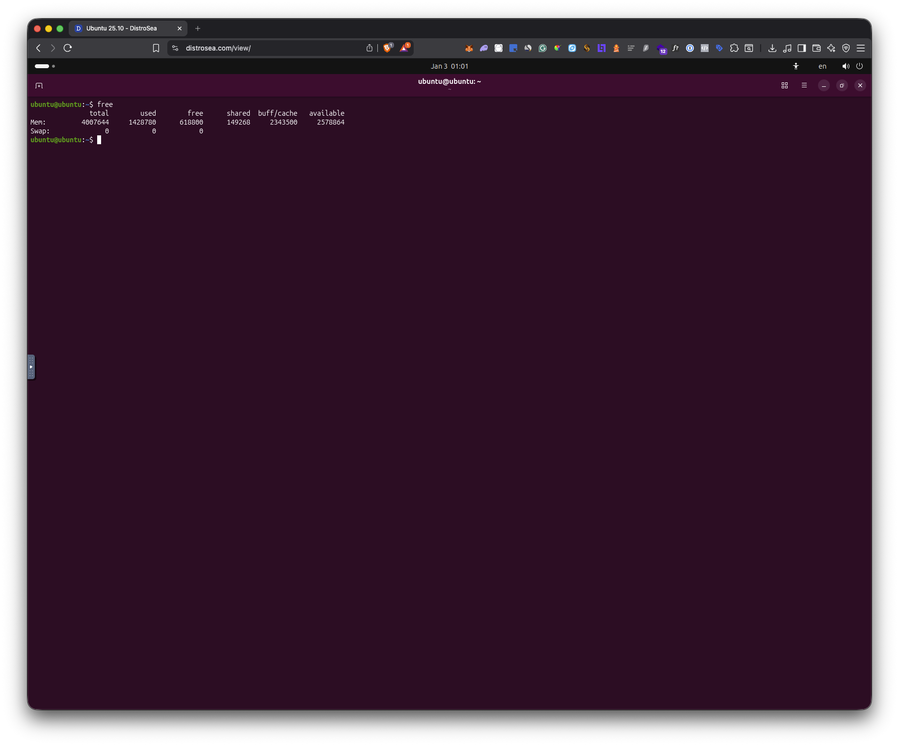
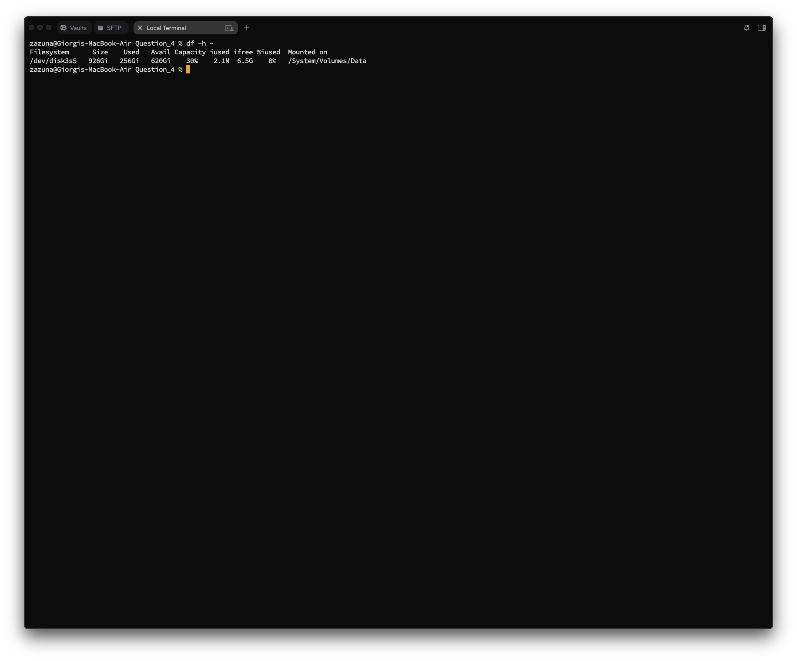
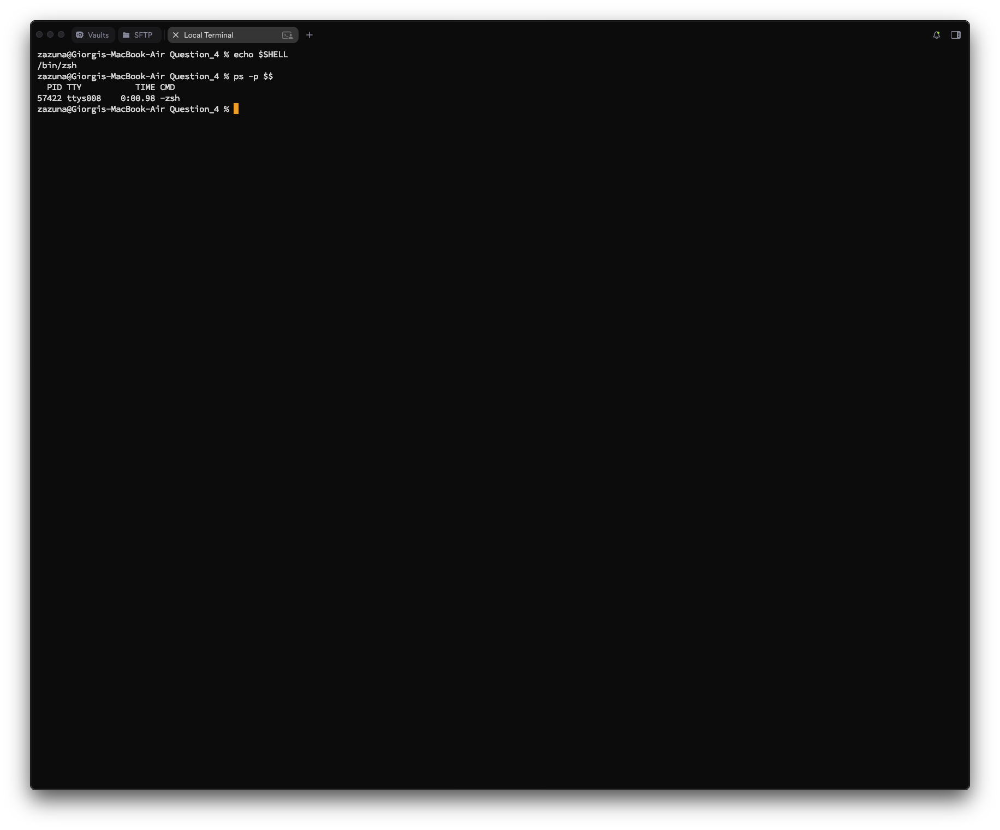
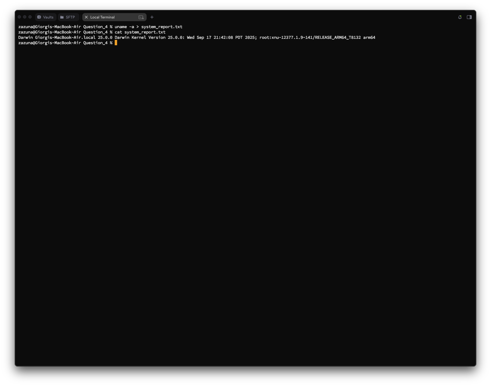
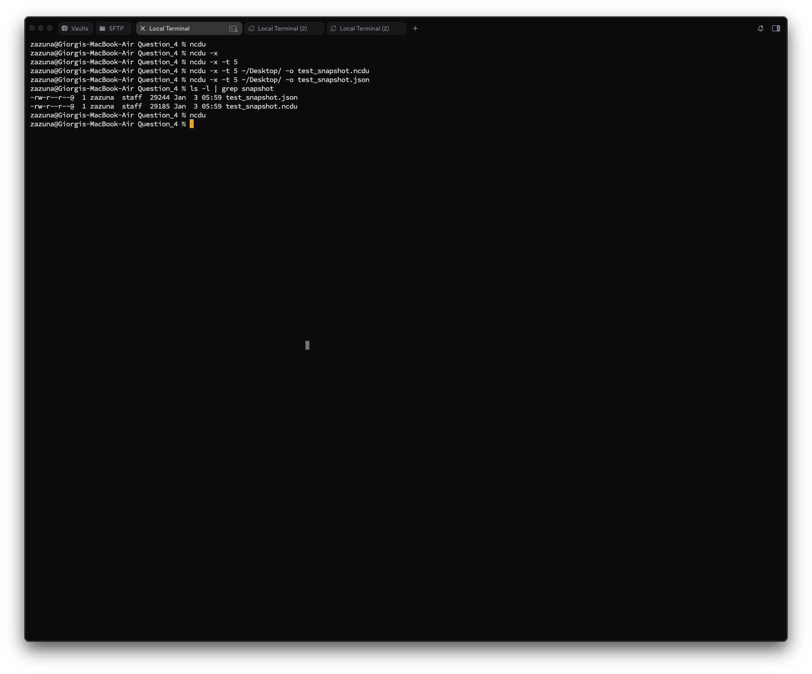

# Question 4
## Question 4_1 — System Uptime Verification

### Task
**Display the time elapsed since the system was last booted.**

---

### What I did
I used:
- `uptime` to view the current time, how long the system has been running, the number of users, and load averages.
- The output "up 9 days, 23:55" indicates the time elapsed since the last boot.

### Commands
```bash
zazuna@Giorgis-MacBook-Air Question_4 % uptime
 2:29  up 10 days,  2:18, 3 users, load averages: 6.38 5.67 5.66
zazuna@Giorgis-MacBook-Air Question_4 % 
```

### Screenshot


## Question 4_2 — User Process Listing

### Task
**List all processes currently running under your user account.**

---

### What I did
I used:
- `ps` (process status) to view active processes.
- `-u zazuna` to filter processes specifically for my user account.
- `-f` (full-format) to see detailed information like UID, PID, and CMD.
- `| head -n 21` to limit the output to the first 21 lines (first 20 processes).

### Commands
```bash
zazuna@Giorgis-MacBook-Air Question_4 % ps -u zazuna | head -21
  UID   PID TTY           TIME CMD
  501   575 ??         7:32.30 /usr/sbin/distnoted agent
  501   576 ??        12:44.85 /usr/sbin/cfprefsd agent
  501   586 ??         2:41.92 /usr/libexec/UserEventAgent (Aqua)
  501   593 ??        66:54.95 /usr/libexec/ContinuityCaptureAgent server
  501   596 ??         0:45.03 /usr/sbin/universalaccessd launchd -s
  501   597 ??         0:35.50 /usr/libexec/pboard
  501   598 ??         1:45.39 /usr/libexec/containermanagerd --runmode=agent --user-container-mode=current --bundle-container-mode=proxy --system-container-mode=none
  501   599 ??        14:43.18 /System/Library/PrivateFrameworks/BiomeStreams.framework/Support/BiomeAgent
  501   600 ??        29:13.17 /System/Library/CoreServices/WindowManager.app/Contents/MacOS/WindowManager
  501   601 ??         2:12.07 /usr/libexec/lsd
  501   604 ??        72:58.00 /System/Library/PrivateFrameworks/CoreSpeech.framework/corespeechd
  501   607 ??         4:54.38 /usr/libexec/secd
  501   609 ??         8:14.84 /System/Library/CoreServices/audioaccessoryd
  501   615 ??         0:44.68 /System/Library/PrivateFrameworks/UserNotificationsCore.framework/Support/usernotificationsd
  501   617 ??        21:46.66 /usr/libexec/trustd --agent
  501   618 ??         8:52.39 /usr/libexec/rapportd
  501   620 ??         2:56.90 /System/Library/PrivateFrameworks/IDS.framework/identityservicesd.app/Contents/MacOS/identityservicesd
  501   623 ??        11:18.44 /System/Library/Frameworks/Accounts.framework/Versions/A/Support/accountsd
  501   624 ??         2:32.77 /usr/libexec/nsurlsessiond
  501   627 ??         5:45.83 /System/Library/PrivateFrameworks/ChronoCore.framework/Support/chronod
zazuna@Giorgis-MacBook-Air Question_4 %
```

### Screenshot


## Question 4_3 — CPU Usage Analysis

### Task
**Identify the process that is consuming the highest CPU usage among your running processes.**

---

### What I did
I used:
- `top` to view real-time system stats.
- `-o cpu` to sort the list by CPU usage.
- `-n 5` to limit the output to the top 5 processes.
- `-user zazuna` to restrict the view to my own processes.

### Commands
```bash
zazuna@Giorgis-MacBook-Air ~ % top -o cpu -n 5 -user zazuna
Processes: 783 total, 7 running, 3 stuck, 773 sleeping, 7424 threads                                                                                                               02:36:07
Load Avg: 4.63, 4.47, 5.00  CPU usage: 29.29% user, 17.71% sys, 52.98% idle  SharedLibs: 858M resident, 168M data, 115M linkedit.
MemRegions: 95 total, 3040K resident, 0B private, 2105M shared. PhysMem: 31G used (3744M wired, 15G compressor), 120M unused.
VM: 439T vsize, 17G framework vsize, 20496008(3990) swapins, 29003228(0) swapouts. Networks: packets: 157833761/165G in, 74456389/34G out.
Disks: 108236096/2168G read, 80305280/2531G written.

PID    COMMAND      %CPU  TIME     #TH  #WQ  #PORT MEM    PURG   CMPRS  PGRP  PPID  STATE    BOOSTS             %CPU_ME %CPU_OTHRS UID  FAULTS     COW     MSGSENT     MSGRECV    SYSBSD
1146   Creative Clo 36.6  10:15.93 48   10/1 807   144M+  0B     92M-   1146  1     stuck    *0[1]              0.09565 0.00000    501  7714130+   916     2586664+    715301+    20066237+
41172  duetexpertd  21.3  09:03.50 6    5/1  570-  25M-   128K-  6816K- 41172 1     stuck    *0[2885+]          51.3517 0.08079    501  1033370+   367     210743+     302263+    17017411+
49697  Brave Browse 20.3  43:09.87 22   1    547   783M+  0B     171M+  31892 31892 sleeping *0[1608033+]       0.00000 0.00000    501  9510824+   3493    13785408+   7830658+   15178936+
1259   Creative Clo 13.3  02:28:29 31   4    1428  563M+  0B     398M-  1146  1146  sleeping *0[1]              0.00000 0.00000    501  20243028+  773     73513651+   18908626+  103596357+
1260   Adobe Deskto 13.0  09:27.41 47   9    751+  144M+  0B     92M-   1260  1146  sleeping *0[1]              1.68484 0.02992    501  3636176+   306     840792+     375616+    20640059+
zazuna@Giorgis-MacBook-Air ~ %
```

### Screenshot


## Question 4_4 — Background Process Execution

### Task
**Start a command in the background and verify that it is running.**

---

### What I did
I used:
- `sleep 500 &` to start a sleep command that runs for 500 seconds.
- The `&` symbol at the end places the job in the background immediately.
- `jobs` to list the currently running background jobs and verify its status.

### Commands
```bash
zazuna@Giorgis-MacBook-Air Question_4 % sleep 50 &
[1] 62629
zazuna@Giorgis-MacBook-Air Question_4 % jobs
[1]  + running    sleep 50
zazuna@Giorgis-MacBook-Air Question_4 % 
```

### Screenshot


## Question 4_5 — Process Priority Management

### Task
**Change the priority (niceness) of one of your running processes and display the updated priority.**

---

### What I did
I used:
- `nice -n 10 sleep 300 &` to start a new process with a niceness of 10.
- `ps -l` (long format) to verify the `NI` (nice) value of the process.
- I have used `renice -15 -p 64538` to change the niceness of the process with PID 64538.

### Commands
```bash
zazuna@Giorgis-MacBook-Air Question_4 % nice -n 10 sleep 300 &
[1] 64538
zazuna@Giorgis-MacBook-Air Question_4 % ps -l
  UID   PID  PPID        F CPU PRI NI       SZ    RSS WCHAN     S             ADDR TTY           TIME CMD
  501 57422 57420     4006   0  31  0 435239584   2832 -      S                   0 ttys008    0:00.94 -zsh
  501 64538 57422     4006   0  31 15 435234448   1104 -      SN                  0 ttys008    0:00.01 sleep 300
  501 52755 51265     4006   0  31  0 435308416   1024 -      Ss+                 0 ttys016    0:00.03 /bin/zsh -il
  501 52892 51265     4006   0  31  0 435309056    768 -      Ss+                 0 ttys018    0:00.02 /bin/zsh -il
zazuna@Giorgis-MacBook-Air Question_4 % sudo renice -15 -p 64538
Password:
zazuna@Giorgis-MacBook-Air Question_4 % ps -l
  UID   PID  PPID        F CPU PRI NI       SZ    RSS WCHAN     S             ADDR TTY           TIME CMD
  501 57422 57420     4006   0  31  0 435239584   2832 -      S                   0 ttys008    0:00.94 -zsh
  501 64538 57422     4006   0  31 -15 435234448   1104 -      S<                  0 ttys008    0:00.01 sleep 300
  501 52755 51265     4006   0  31  0 435308416   1040 -      Ss+                 0 ttys016    0:00.03 /bin/zsh -il
  501 52892 51265     4006   0  31  0 435309056    784 -      Ss+                 0 ttys018    0:00.02 /bin/zsh -il
zazuna@Giorgis-MacBook-Air Question_4 % 
```

### Screenshot


## Question 4_6 — Memory Usage Monitoring

### Task
**Display memory usage information in a human-readable format.**

---

### What I did
I used:
- `free` to display memory usage information.

### Commands
```bash
ubuntu@ubuntu:~$ free
              total        used        free      shared  buff/cache   available
Mem:        4007644     1428780      618800      149268     2343500     2578864
Swap:             0           0           0
ubuntu@ubuntu:~$
```

### Screenshot


## Question 4_7 — Disk Space Inspection

### Task
**Display the disk space usage of the filesystem where your home directory resides.**

---

### What I did
I used:
- `df -h ~` to display free disk space.
- `-h` formats the output in human-readable sizes (GB/MB).
- `~` targets the home directory specifically.

### Commands
```bash
zazuna@Giorgis-MacBook-Air Question_4 % df -h ~
Filesystem      Size    Used   Avail Capacity iused ifree %iused  Mounted on
/dev/disk3s5   926Gi   256Gi   620Gi    30%    2.1M  6.5G    0%   /System/Volumes/Data
zazuna@Giorgis-MacBook-Air Question_4 % 
```

### Screenshot


## Question 4_8 — Shell Identification

### Task
**Display the name of the shell currently in use.**

---

### What I did
I used:
- `echo $SHELL` to print the path of the shell executable stored in the SHELL environment variable.
- Alternatively, `ps -p $$` can be used to show the process name of the current shell PID.

### Commands
```bash
zazuna@Giorgis-MacBook-Air Question_4 % echo $SHELL
/bin/zsh
zazuna@Giorgis-MacBook-Air Question_4 % ps -p $$
  PID TTY           TIME CMD
57422 ttys008    0:00.98 -zsh
zazuna@Giorgis-MacBook-Air Question_4 %
```

### Screenshot


## Question 4_9 — Output Redirection

### Task
**Redirect the output of a system information command of your choice into a file named `system_report.txt`.**

---

### What I did
I used:
- `uname -a` to get detailed system kernel information.
- `>` to redirect that output into `system_report.txt`.
- `cat` to verify the file was written successfully.

### Commands
```bash
zazuna@Giorgis-MacBook-Air Question_4 % uname -a > system_report.txt
zazuna@Giorgis-MacBook-Air Question_4 % cat system_report.txt 
Darwin Giorgis-MacBook-Air.local 25.0.0 Darwin Kernel Version 25.0.0: Wed Sep 17 21:42:08 PDT 2025; root:xnu-12377.1.9~141/RELEASE_ARM64_T8132 arm64
zazuna@Giorgis-MacBook-Air Question_4 %
```

### Screenshot


## Question 4_10 — Disk Usage Visualization

### Task
**Demonstrate the usage of the `ncdu` tool using appropriate options and briefly explain what it shows.**

---

### What I did
I used:
- `ncdu` (NCurses Disk Usage) which is an interactive disk usage analyzer.
- Since `ncdu` launches an interactive graphical interface in the terminal, I captured the command execution.
- Explanation: `ncdu` scans the directory and displays a sorted list of files and folders by size, allowing for easy navigation and cleanup of large files. It shows exact sizes and usage bars.
- `ncdu -x` ensures to scan only files and directories locate on the same filesystem.
- `ncdu -x -t 5` to use 5 threads for scanning file system, faster than default which uses 1 thread.
- `ncdu -x -t 5 ~ o test_snapshot.ncdu` to create a snapshot of the selected directory for later analysis.
- `ncdu -x -t 5 ~ o test_snapshot.json` same as previous but in more human readable format.

### Commands
```bash
zazuna@Giorgis-MacBook-Air Question_4 % ncdu                                     
zazuna@Giorgis-MacBook-Air Question_4 % ncdu -x                                  
zazuna@Giorgis-MacBook-Air Question_4 % ncdu -x -t 5                             
zazuna@Giorgis-MacBook-Air Question_4 % ncdu -x -t 5 ~/Desktop/ -o test_snapshot.ncdu
zazuna@Giorgis-MacBook-Air Question_4 % ncdu -x -t 5 ~/Desktop/ -o test_snapshot.json
zazuna@Giorgis-MacBook-Air Question_4 % ls -l | grep snapshot
-rw-r--r--@  1 zazuna  staff  29244 Jan  3 05:59 test_snapshot.json
-rw-r--r--@  1 zazuna  staff  29185 Jan  3 05:59 test_snapshot.ncdu
zazuna@Giorgis-MacBook-Air Question_4 % ncdu
ncdu 2.9.2 ~ Use the arrow keys to navigate, press ? for help                                                                                                                               
--- /Users/zazuna/Desktop/BITS Pilani/Semester 2/Command Line Interfaces and Scripting/BITS_Command_Line_Graded_Lab_Assignment_Modules_1_4/Question_4 --------------------------------------
    1.1 MiB [##########################] /Screenshots                                                                                                                                       
   32.0 KiB [                          ]  test_snapshot.json
   32.0 KiB [                          ]  test_snapshot.ncdu
   12.0 KiB [                          ]  Readme.md
    8.0 KiB [                          ]  .DS_Store
    4.0 KiB [                          ]  html
    4.0 KiB [                          ]  system_report.txt
```

### Screenshot
